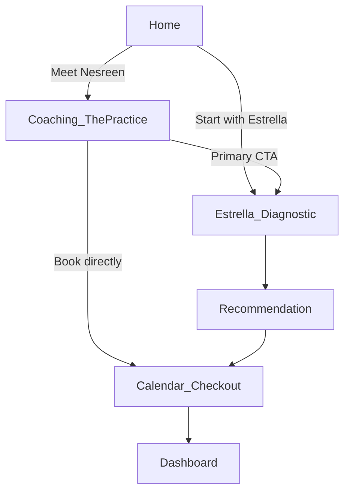
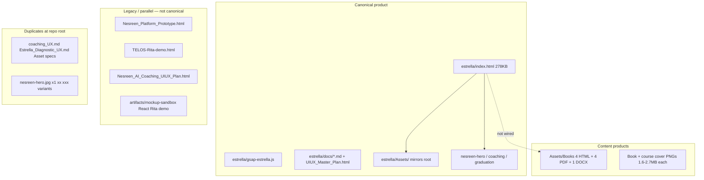
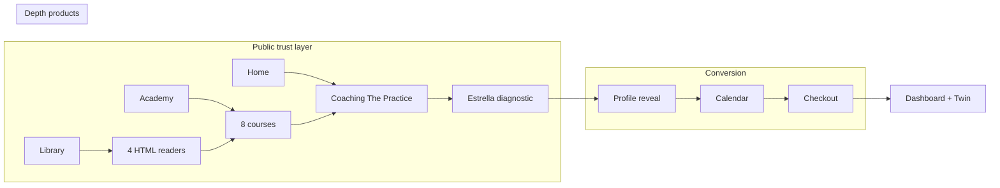
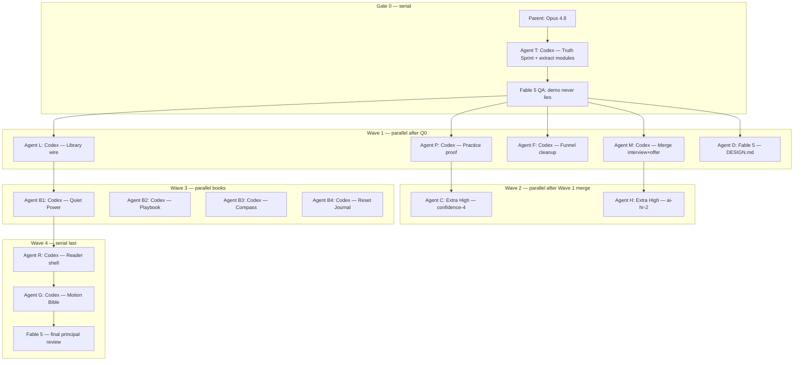
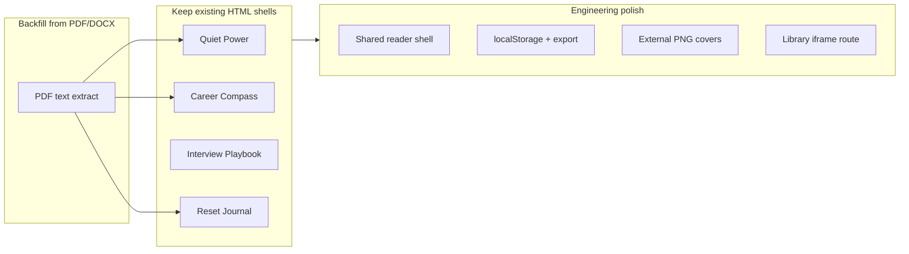
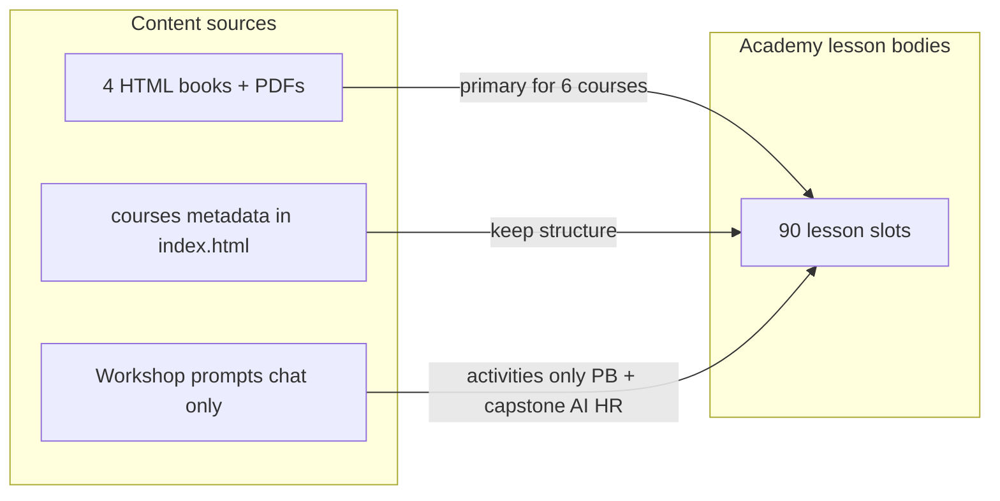

# Estrella Coaching Platform Redesign Plan

## North star

Build a **relationship-led coaching surface**, not a product catalog. The Coaching page is the **trust event** before Estrella's diagnostic **conversion event** ([coaching_UX.md](C:/Users/husam/OneDrive/Documents/Estrella_Final/estrella/docs/coaching_UX.md)).

**Locked decisions (from you):**

- **Workspace:** [C:\Users\husam\OneDrive\Documents\Estrella_Final](C:/Users/husam/OneDrive/Documents/Estrella_Final) → repo [husam-hammami/estrella-platform](https://github.com/husam-hammami/estrella-platform)
- **Stack this phase:** Prototype-first in [estrella/index.html](C:/Users/husam/OneDrive/Documents/Estrella_Final/estrella/index.html) (~6k-line single file)
- **Visual anchor:** Cream editorial luxury (current `:root` tokens — **not** the dark Midnight variant in [UIUX_Master_Plan.html](C:/Users/husam/OneDrive/Documents/Estrella_Final/estrella/docs/UIUX_Master_Plan.html))




---

## Bird's-eye view — full project audit

Complete inventory of [Estrella_Final](C:/Users/husam/OneDrive/Documents/Estrella_Final): every file category, every image visually inspected, strategic docs read, prototype views mapped. **This is the foundation for everything that follows.**

### Repository map




| Layer        | What it is                                                             | Status                                                           |
| ------------ | ---------------------------------------------------------------------- | ---------------------------------------------------------------- |
| **Product**  | `estrella/index.html` — 14 views, ~6k lines, cream tokens              | Active prototype; Coaching ~40% of strategy                      |
| **Motion**   | `gsap-estrella.js` — view transitions, tile stagger                    | Partial; Coaching ScrollTrigger pending                          |
| **Strategy** | `coaching_UX.md`, `Estrella_Diagnostic_UX.md`, `UIUX_Master_Plan.html` | Authoritative; dark Midnight plan conflicts with cream prototype |
| **Books**    | 4 interactive HTML readers + PDF masters                               | Content-rich; not linked from Library                            |
| **Courses**  | 8 in `courses[]`; 1 playable lesson                                    | Syllabus complete; bodies mostly stubs                           |
| **Legacy**   | Root-level HTML prototypes + Rita React sandbox                        | Reference only — do not extend                                   |


### 14 prototype views (`estrella/index.html`)


| View                | ID                 | Maturity    | Notes                                                              |
| ------------------- | ------------------ | ----------- | ------------------------------------------------------------------ |
| Home                | `#view-landing`    | Strong      | Hero + `nesreen-hero.jpg` + dual CTAs                              |
| About               | `#view-about`      | Strong      | Graduation photo, testimonials (layla/karim/sofia)                 |
| **Coaching**        | `#view-services`   | **Thin**    | `.practice-page` — hero + 3 tiles + prep strip; target of redesign |
| Estrella diagnostic | `#view-start`      | Good        | Profile reveal, 7-question arc per Diagnostic UX                   |
| Calendar            | `#view-calendar`   | Functional  | Simulated booking                                                  |
| Checkout            | `#view-checkout`   | Functional  | Payment mock                                                       |
| Onboarding          | `#view-onboarding` | Scripted    | Post-payment Estrella chat                                         |
| Readiness           | `#view-readiness`  | Visual      | Concentric rings reveal                                            |
| Dashboard           | `#view-dashboard`  | Rich        | Session card, rings, recos                                         |
| Library             | `#view-library`    | Visual only | 4 books; **toast not reader**                                      |
| Academy             | `#view-academy`    | Rich UI     | 8 courses; constellation canvas                                    |
| Course detail       | `#view-course`     | Dynamic     | `openCourse()`                                                     |
| Lesson player       | `#view-lesson`     | Partial     | Only `ai-hr-1` full body                                           |
| AI Twin             | `#view-twin`       | Mock        | Voice interface                                                    |


Hidden legacy: `[data-legacy="services-old"]` — full 7-track coaching page still in DOM (~800 lines CSS/JS).

### Complete image asset inventory (visually inspected)

#### Brand & founder portraits


| File                                                                         | Location                       | What it shows                                                 | Used in prototype         |
| ---------------------------------------------------------------------------- | ------------------------------ | ------------------------------------------------------------- | ------------------------- |
| `Estrella.jpeg`                                                              | `Assets/` + `estrella/Assets/` | Logo: gold star arc, "Estrella / BORN TO SHINE" on black      | Nav brand                 |
| `nesreen-hero.jpg`                                                           | `estrella/` (681 KB)           | Professional portrait, black blazer, cream bg, gold necklaces | Home, About, Dashboard    |
| `nesreen-coaching.jpg`                                                       | `estrella/` (189 KB)           | Seated in bouclé chair, brown dress, warm editorial           | **Coaching hero**         |
| `nesreen-graduation.jpg`                                                     | `estrella/` + root dupes       | MBA graduation                                                | About                     |
| `nesreen_About.jpg`, `x1.jpg`, `xx.jpg`, `xxx.jpg`, `xxxx.jpg`, `xxxxxx.jpg` | Repo root                      | Alternate portrait crops/exports                              | **Orphans — consolidate** |
| `x.jpeg`                                                                     | `Assets/` + `estrella/Assets/` | Unknown secondary asset                                       | Unclear                   |
| `c90ed6b1-....png`                                                           | `estrella/Assets/` only        | Duplicate headshot variant                                    | Unused?                   |


#### Book covers (PNG/JPG, 2–2.7 MB each — premium print quality)


| File                     | Visual design                                | **Branding issue**                           |
| ------------------------ | -------------------------------------------- | -------------------------------------------- |
| `Quiet_Power.png`        | Purple + gold, mountain sunrise, serif title | Author reads **"THEA AUSTIN"** — not Nesreen |
| `Career_Compass.png`     | Navy + gold, 3D compass, topographic lines   | **"THEA AUSTIN"**                            |
| `Interview_Playbook.jpg` | Forest green cloth texture, cream type       | **"THEA AUSTIN"**                            |
| `Reset_Journal.png`      | Dusty rose journal, gold botanical line art  | **"THEA AUSTIN"**                            |


**Critical:** UI copy says "Written by Nesreen" but cover art says Thea Austin. Must fix before ship (regenerate covers or overlay author name).

#### Course banners (PNG, landscape marketing art)


| File                     | Visual                                                                       | Pairs with                       |
| ------------------------ | ---------------------------------------------------------------------------- | -------------------------------- |
| `Confidence_Reset.png`   | Purple mountains, "CONFIDENCE RESET COURSE"                                  | Reset Journal + Academy featured |
| `Leadership_Burnout.png` | Purple split, silhouette on peak, 4 icons (Clarity/Resilience/Energy/Impact) | Quiet Power                      |
| `Offer_machine.png`      | Purple path-to-star, 4 pillars (Clarity/Strategy/Conversion/Freedom)         | Interview Playbook               |


#### Coaching engagement tiles (JPG, ~16–24 KB — neumorphic icons)


| File                                                                              | Icon metaphor                        | Used on Coaching tiles                   |
| --------------------------------------------------------------------------------- | ------------------------------------ | ---------------------------------------- |
| `Career_Coaching.jpg`                                                             | Gold compass in cream square         | Single session                           |
| `Leadership_Coaching.jpg`                                                         | Purple geometric mountain + star     | Program                                  |
| `Executive_Caoaching.jpg`                                                         | Teal crown + star (typo in filename) | Partnership                              |
| `Burnout_Confidence.jpg`                                                          | Rose sun-over-water medallion        | Legacy 7-track (unused in practice-page) |
| `Career_Clarity.jpg`, `CV_LinkedIN.jpg`, `Interview_Coaching.jpg`, `Not_Sure.jpg` | Track icons                          | Legacy `services[]` only                 |


#### Testimonial portraits


| File        | Appearance                                 | Note                                     |
| ----------- | ------------------------------------------ | ---------------------------------------- |
| `layla.jpg` | Woman, beige blazer, professional headshot | Stock-quality; used About + testimonials |
| `karim.png` | Man, taupe blazer, beard                   | Same                                     |
| `sofia.png` | (not re-read; paired set)                  | Same                                     |


### Books folder — full content stack


| Title              | HTML   | PDF pages | DOCX  | HTML word coverage    |
| ------------------ | ------ | --------- | ----- | --------------------- |
| Quiet Power        | 347 KB | 36        | —     | ~82% of PDF           |
| Career Compass     | 161 KB | 54        | —     | ~70% of PDF           |
| Interview Playbook | 148 KB | 50        | 87 KB | ~101%                 |
| Reset Journal      | 397 KB | 79        | —     | ~42% (workbook shell) |


### Strategic product architecture (from docs)




**Core principle (coaching_UX.md):** Estrella = front door; Nesreen = destination. First 10 minutes make the price obvious.

**Diagnostic (Estrella_Diagnostic_UX.md):** 7 sequenced questions → structured brief for Nesreen — not reflective chatbot cosplay.

---

## Bird's-Eye Platform Audit (HR × UX × Coaching specialist)

*Independent agent pass — May 2026. Opinionated; supersedes scattered notes below where they conflict.*

### Executive summary


|                      |                                                                                                                                                                           |
| -------------------- | ------------------------------------------------------------------------------------------------------------------------------------------------------------------------- |
| **What it is**       | Single-file prototype: Estrella diagnostic → coaching booking → portal (dashboard, twin, library, academy) + 4 interactive books + 8 async courses                        |
| **Who it's for**     | Gulf mid-to-senior professionals at inflection points; **secondary wedge:** CHROs / HR directors via AI for HR                                                            |
| **Biggest strength** | Conversion spine is **strategically correct** — cream editorial, Practice ≠ catalog, diagnostic + profile reveal matches both UX docs; `ai-hr-1` is credible CHRO content |
| **Biggest gap**      | **Merchandises like a full suite, delivers like a demo** — library toasts instead of readers; 89/90 lessons empty; wrong lesson plays on featured course                  |
| **North star**       | *Estrella earns conviction in ten minutes; Nesreen delivers transformation over months — books and Academy extend the relationship, they don't replace it.*               |


### UI/UX scorecard (0–10)


| Dimension              | Score | Verdict                                                                               |
| ---------------------- | ----- | ------------------------------------------------------------------------------------- |
| Visual system cohesion | 7.5   | Cream prototype strong; 4 book readers use separate dark palettes                     |
| Information hierarchy  | 7.0   | Good editorial rhythm; 200px logo + dual nav split attention                          |
| Coaching trust surface | 6.0   | Practice structure right; missing testimonials, Gulf proof, before/during/after depth |
| Academy credibility    | 5.5   | Syllabi pass procurement skim; playback + fake enrollments undermine trust            |
| Library / books        | 4.0   | Beautiful grid; **zero reader integration**                                           |
| Diagnostic conversion  | 8.0   | Best surface on platform — 7Q arc, profile, tiered CTAs                               |
| Mobile readiness       | 6.0   | Breakpoints exist; lesson two-column + huge logo risk                                 |
| Motion                 | 7.5   | GSAP + reduced-motion; not all views animated                                         |
| Accessibility          | 5.5   | Partial focus/aria; no skip link; legacy onboarding voice off-brand                   |
| HR domain authenticity | 6.5   | High in `ai-hr-1`; low elsewhere — no GCC compliance path, rings feel generic         |


### Coaching — what world-class looks like here

Not SKUs. Not chatbot warmth. A **relationship preview** in six beats:

1. Recognition — inflection point before categories
2. Competence — Gulf + MBA + AI-in-HR + 7Shots credibility on Practice (not only About)
3. Process — Conversation → Brief → Session → Roadmap → Estrella between sessions
4. Risk reversal — first 15 minutes, cancellation, what Nesreen reads before call
5. Proof — Layla/Karim/Sofia on Practice, not buried on About
6. One door — Start with Estrella; book-direct + teams as footnotes

**Reuse legacy hidden block** “Inside the Experience” (prep → session → roadmap) on Practice — already written, currently buried in `data-legacy`.

### Academy — agent + prior audit alignment

- **8 courses, 1 lesson** — feature **AI for HR** on hero until Confidence Reset has real content  
- **Workshop prompts:** source material for exercises, not async syllabus (see Courses full audit)  
- **Priority content:** Finish AI-HR Module 1 (4 lessons) before commoditized Personal Branding async  
- **Dedupe:** `interview` + `offer` overlap — merge or differentiate before scaling

### Books — funnel role

Refactor skins + wire Library. **Do not recreate.** Unify author spelling (Nesreen / Nesrin / Abd Elhakim). Connect 7Shots book copyright to Estrella platform story on About or footer.

### HR domain gaps (Gulf buyer)

Missing: MOHRE/Emiratisation, data residency, Arabic, CHRO-specific landing, enterprise/7Shots → coaching bridge, substantiated stats (800+ leaders, 98% rebook).

**Feels like AI slop:** activity rings, fake enrollments, onboarding “I'm so glad you're here”, same AI-HR lesson for every course click.

### Revised priority roadmap (agent + founder intent)


| Priority | Item                                            | Rationale                                          |
| -------- | ----------------------------------------------- | -------------------------------------------------- |
| P0       | **Coaching Practice rebuild** (“Session Brief”) | Primary creative milestone; trust before price     |
| P0.5     | **Library wire + academy honesty**              | Fast trust fixes; stop lying to curious buyers     |
| P1       | **Funnel legacy cleanup**                       | Kill onboarding/readiness post-payment path        |
| P1       | **Branding audit**                              | Author names, THEA AUSTIN covers, Nesreen spelling |
| P2       | **AI-HR Module 1** (4 lessons)                  | Differentiated HR wedge; template for all lessons  |
| P2       | **Books refactor**                              | Cream chrome + reader shell + PDF backfill         |
| P3       | **HR leader entry path**                        | Secondary CTA without splitting consumer story     |
| P4       | **Remaining Academy + persistence**             | localStorage profile, calendar/payment spine       |


### Risks register

Legal/unverified stats · author name drift · workshop→Academy verbatim · duplicate courses · single 6k-line file · missing synced assets in workspace (PNG covers may be local/OneDrive only — verify at implementation) · legacy dark master plan confusing stakeholders

---

## Multi-Agent Product Blueprint (5 specialist reviews)

*Agents: [Coaching](f5d681e7-e00d-45de-909e-46969a2078aa) · [Books×4](1117fce1-d7aa-4007-9d07-53a8228fbd21) · [HR courses](cc7f8c24-682e-4ffe-b99c-e841b639308b) · [Career/Interview×4](8ae745c7-2bbc-497e-90a2-c7b6d2962d2a) · [Wellness+Motion*](a1020a37-6375-4c4d-b038-d3ac652931f8)

### Unified concept names


| Surface                   | Concept                                                | One-line thesis                                                                      |
| ------------------------- | ------------------------------------------------------ | ------------------------------------------------------------------------------------ |
| Coaching `#view-services` | **The Briefing** (page) + **Session Brief** (artifact) | Relationship preview, not catalog — ten minutes earns the right to ask for AED 6,000 |
| Diagnostic `#view-start`  | **The Briefing** (conversation)                        | Seven questions → document Nesreen reads before minute one                           |
| Library                   | **Estrella Editions**                                  | Four sub-brands inside one cream reader shell                                        |
| Academy                   | **Guided doing**                                       | Books teach; courses exercise + Estrella tutor                                       |
| Motion                    | **Editorial choreography**                             | GSAP for views + selective scroll; no AI slop rings                                  |


### Master decision table — write / add / remove / modify / generate


| Product                | Keep                                                 | Modify                                                          | Remove                                                       | Generate from scratch                                                              | Rewrite                                   |
| ---------------------- | ---------------------------------------------------- | --------------------------------------------------------------- | ------------------------------------------------------------ | ---------------------------------------------------------------------------------- | ----------------------------------------- |
| **Coaching**           | 3 relationship tiers, one CTA, no prices on Practice | Hero copy (Nesreen voice), prep strip → "The Briefing", footnav | Legacy 7-track DOM, post-payment onboarding, tile hover-lift | Single-session tier JPG (not compass), 3 engagement SVGs, testimonials on Practice | Headline *"not a catalog"*; checkout copy |
| **Quiet Power**        | Full 8-ch reader, Q.U.I.E.T.                         | Cream reader chrome; Gulf sidebars; author spelling             | Duplicate tips; emoji chrome                                 | SVG ch-deco; external PNG cover                                                    | About author bibliography                 |
| **Career Compass**     | 15-ch structure                                      | Part dividers; assessment tiers; dedupe interview ch overlap    | Purple body copy bleed                                       | 90-day action plan tool; compass SVGs                                              | Ch 8–9 cross-links to Playbook            |
| **Interview Playbook** | 16-ch + assignments                                  | Ch 15 question bank UI (filterable); Gulf confessions           | Emoji assignment headers                                     | ~55 missing questions from PDF                                                     | 30-day plan as linked checklist           |
| **Reset Journal**      | Welcome, wheels, NLP                                 | Habit sliders; auto-save                                        | "90 days" claim until content exists                         | **Days 22–90** pages OR honest "digital companion" reposition                      | Day picker + calendar spine UX            |
| **AI for HR**          | 4-module arc, ai-hr-1 lesson, leverage/risk pattern  | GCC compliance (PDPL, MOHRE); hours label ~6h                   | Works-council-only framing; Career_Compass cover             | `ai-hr` banner + icon; lessons 2–16 bodies                                         | Outcome line for legal sign-off           |
| **HR Foundations**     | Ulrich + lifecycle skeleton                          | **"Gulf Edition"**; M2 visa/gratuity; capstone → ai-hr          | 6hr claim; Leadership_Coaching cover                         | `hr-foundations` banner; hrf-1 free preview                                        | All lesson examples for GCC               |
| **Personal Branding**  | 4-module / 12-lesson async shape                     | Module titles; workshop activities as exercises                 | Kirkpatrick; appearance module                               | `Personal_Branding.png` cover; artifact PDFs                                       | Lessons from Compass ch5 + workshop       |
| **Interview + Offer**  | Playbook as manuscript                               | **Merge** to Interview & Offer Lab (~20 lessons, AED 749)       | Separate `offer` SKU; duplicate mock/behavioral              | Module 5 uses Offer_machine art                                                    | Negotiation capstone from ch10            |
| **Speaking**           | 4-module / 16-lesson                                 | Quiet Power ch5–6 integration; branding 60s intro bridge        | Duplicate LinkedIn content                                   | `Executive_Presence.png` cover                                                     | Capstone signature talk                   |
| **Confidence Reset**   | 7-day positioning; lavender track                    | Hero stats; Day 4 as showcase lesson                            | Fake 55% progress                                            | **Lesson 4** full body (Rejection Autopsy)                                         | Lessons 1–3,5–6 from Journal              |
| **Leadership**         | Q.U.I.E.T. spine; Signature track                    | Leverage/Trap lesson anatomy (from ai-hr)                       | Dashboard ring cosplay                                       | Lesson 1 + capstone rhythm doc                                                     | All 6 lessons from Quiet Power            |


### Visual & cover change register


| Asset                                         | Action                                                                |
| --------------------------------------------- | --------------------------------------------------------------------- |
| `Executive_Caoaching.jpg`                     | Rename → `Executive_Coaching.jpg`                                     |
| `Career_Coaching.jpg` on Practice single tile | Replace — compass = old taxonomy                                      |
| `Quiet_Power.png` on branding course          | Replace → `Personal_Branding.png`                                     |
| `Career_Compass.png` on ai-hr                 | Replace → dedicated AI-HR banner                                      |
| `Leadership_Coaching.jpg` on hr-foundations   | Replace → lifecycle arc banner                                        |
| Book covers in HTML                           | Extract base64 → `Assets/*.png`; fix author to **Nesrin Abd Elhakim** |
| Library author                                | "Nesreen" conversational + legal byline once                          |
| Emoji `ch-deco` in books                      | → line SVG motifs per title                                           |
| Onboarding/twin orb rings                     | Remove (motion slop denylist)                                         |


### Experience design + animation register


| Surface            | Experience beat                                                   | Animation                                                              |
| ------------------ | ----------------------------------------------------------------- | ---------------------------------------------------------------------- |
| Practice           | Scroll: arrival → manifesto pin → tier chapters → Briefing climax | Hero stagger, stat count-up once, quote pin, prep strip orb pulse once |
| Briefing close     | Session Brief card sections stagger; recommendation last          | Input fade → profile stagger → CTA                                     |
| Library            | Card → detail sheet → reader                                      | Cover scale-in; filter functional                                      |
| Reader             | Cream shell + sub-brand sidebar/hero only                         | Chapter slide 280ms; reduced-motion cut                                |
| Reset Journal      | Day rail, auto-save, "Day sealed"                                 | Toggle ticks; no confetti                                              |
| Academy grid       | Track constellation emphasis on filter                            | Card `--mx/--my` glow; module stagger on open                          |
| Lesson player      | Leverage/Risk or Leverage/Trap cards; exercise pin                | Section ScrollTrigger once; tutor CSS bounce only                      |
| Interview mock     | Question card flip                                                | Flip + reduced-motion instant                                          |
| Negotiation module | Comp stack bar                                                    | Transform-only GSAP                                                    |


**Motion Bible rule:** GSAP = view transitions + one hero moment per view; CSS = hovers/toggles; **denylist:** pulsing rings, fake dashboards, streaks, XP, parallax stacks.

### Catalog change — merge interview + offer

- **New title:** Interview & Offer Lab (subtitle: *Through negotiation*)
- **5 modules · ~20 lessons · ~6 hrs · AED 749**
- Retire `id:'offer'` → redirect to merged course Module 5
- **7 courses remain in catalog** after merge (not 8)

### Authoring priority (all products)

1. P0 trust surgery: `openLesson` honesty, library wire, hero metadata fix
2. Coaching Practice copy + legacy delete + Briefing rename
3. `confidenceLesson4` + `ai-hr` M2 audit + M4 policy lessons
4. Merge interview+offer catalog
5. Reader shell P0 + Reset Journal honesty/content
6. Interview Playbook ch15 backfill + native reader
7. Personal Branding Module 3 (LinkedIn) from Compass + workshop
8. Leadership lesson 1 + Quiet Power cross-links
9. Remaining lesson bodies + HR Foundations Gulf pass
10. New covers/banners + motion ScrollTrigger pass

### Per-product detail location

Full agent specs (section-by-section copy, lesson-by-lesson authoring tables, UI component specs) live in agent transcripts; this blueprint is the **implementation index**. Key files:

- Coaching: `#view-services`, `#view-start`, legacy block, `gsap-estrella.js`
- Books: `Assets/Books/*.html`, `#view-library`, future `#view-reader`
- Courses: `courses[]` ~5290–5572, `sampleLesson`, `openLesson()`
- Motion: `gsap-estrella.js`, CSS `acadRise`, canvas constellation, onboarding rings

---


| Working                                | Broken / missing                                     |
| -------------------------------------- | ---------------------------------------------------- |
| Cream design system in prototype       | UIUX_Master_Plan.html describes different dark theme |
| All P0 portraits exist in `estrella/`  | Root-level duplicate images/docs create confusion    |
| Book covers + course banners on disk   | Covers say wrong author name (Thea Austin)           |
| `estrella/Assets/` mirrors root Assets | Library doesn't open HTML editions                   |
| Full Academy UI shell                  | 7/8 lessons are stubs                                |
| 4 premium HTML book apps               | No localStorage; Reset Journal loses entries         |
| GSAP layer started                     | Coaching page doesn't match strategy depth           |
| 8-course catalog with rich metadata    | Asset_Specifications.md lists only 3 courses         |


### Recommended execution order (sequence only — no timelines)

**Milestone:** *A demo that never lies.*


| Step  | Work                                                                                                       |
| ----- | ---------------------------------------------------------------------------------------------------------- |
| **0** | Truth Sprint + JS module extraction (`courses.js`, `lessons/`*, `open-lesson.js`, `library.js`)            |
| **1** | Practice proof — testimonials, quote, Briefing CTA, tier picker, legacy delete (not full GSAP opera first) |
| **2** | Two authored lessons — confidence-4 + ai-hr-2 (audit)                                                      |
| **3** | Library v1 — open HTML (iframe/tab OK; native shell later)                                                 |
| **4** | Funnel cleanup — onboarding/readiness amputation                                                           |
| **5** | DESIGN.md + metric policy                                                                                  |
| **6** | Merge interview+offer                                                                                      |
| **7** | Reader shell + journal save                                                                                |
| **8** | Content + GCC pass (ongoing)                                                                               |
| **9** | Motion Bible **last**                                                                                      |


*Principal review supersedes parallel multi-agent authoring order where conflicting.*

---

## Agent orchestration plan

**Principle:** One **parent orchestrator** runs a **serial gate**, then launches **parallel child agents** with **non-overlapping file ownership**. No two implementation agents edit `index.html` at the same time until modules are extracted. **No calendar estimates** — waves complete when gates pass.

### Model roster (highest performance)


| Role                                                     | Model                            | Why                                                              |
| -------------------------------------------------------- | -------------------------------- | ---------------------------------------------------------------- |
| **Parent orchestrator**                                  | **Claude Opus 4.8 Thinking Max** | Merge conflicts, wave gates, scope cuts, final coherence         |
| **Truth Sprint + module split**                          | **GPT-5.3 Codex High Fast**      | Highest-throughput correct code on `index.html` / new JS modules |
| **Practice / Funnel / Library / Merge** (implementation) | **GPT-5.3 Codex High Fast**      | UI + routing + `courses[]` surgery                               |
| **Lesson bodies** (Nesrin voice, HR depth)               | **GPT-5.5 Extra High**           | Long-form lesson prose, exercises, tutor chips                   |
| **DESIGN.md, CONTEXT.md, metric policy**                 | **Claude Fable 5 Thinking High** | Editorial precision, voice rules, harsh QA                       |
| **Per-book HTML refactor** (×4 parallel)                 | **GPT-5.3 Codex High Fast**      | Isolated files, mechanical + structural                          |
| **Reader shell engineering**                             | **GPT-5.3 Codex High Fast**      | New `#view-reader` + shared CSS/JS                               |
| **Motion Bible** (last wave)                             | **GPT-5.3 Codex High Fast**      | `gsap-estrella.js` only                                          |
| **Pre-merge QA gate**                                    | **Claude Fable 5 Thinking High** | Truth check: no lying CTAs, stats, wrong lessons                 |
| **Read-only audits / explore**                           | **Composer 2.5 Fast**            | Fast inventory when orchestrator needs status                    |


*Use `Task` subagents with explicit `model` param. Parent never skips Gate 0.*

### Orchestration flow




### Agent charter table (file ownership)


| Agent ID           | Model           | Owns (write)                                                                                             | Must not touch             | Deliverable                                                  |
| ------------------ | --------------- | -------------------------------------------------------------------------------------------------------- | -------------------------- | ------------------------------------------------------------ |
| **T — Truth**      | Codex High Fast | `estrella/js/open-lesson.js`, `library.js`, `data/courses.js`, metric strings in `index.html` (surgical) | Books HTML, Practice CSS   | Honest `openLesson`; library opens books; fake stats removed |
| **P — Practice**   | Codex High Fast | `#view-services` HTML/CSS, `practice-*` in `index.html`                                                  | `courses[]`, lesson bodies | Testimonials, quote, Briefing CTA, tier picker               |
| **L — Library**    | Codex High Fast | `#view-library` handlers, `library.js`                                                                   | Academy, Practice          | Read/Preview opens `Assets/Books/*.html`                     |
| **F — Funnel**     | Codex High Fast | `#view-onboarding`, `#view-readiness`, checkout routes                                                   | Books                      | Legacy path removed; checkout copy fixed                     |
| **M — Merge**      | Codex High Fast | `data/courses.js` interview+offer merge                                                                  | Lesson content             | 7-course catalog, `offer` redirect                           |
| **D — Design**     | Fable 5         | `estrella/DESIGN.md`, `estrella/docs/CONTEXT.md`                                                         | `index.html`               | Tokens, voice, metric policy                                 |
| **C — Confidence** | Extra High      | `data/lessons/confidence-4.js`                                                                           | Other lessons              | Full lesson 4 + routing hook                                 |
| **H — AI-HR**      | Extra High      | `data/lessons/ai-hr-2.js`                                                                                | Other lessons              | Audit lesson body + tutor                                    |
| **B1–B4 — Books**  | Codex High Fast | One file each in `Assets/Books/`                                                                         | `index.html`               | Per-book agent plan deltas                                   |
| **R — Reader**     | Codex High Fast | `estrella/reader/*`, `#view-reader`                                                                      | Motion                     | Native shell v1                                              |
| **G — Motion**     | Codex High Fast | `gsap-estrella.js` only                                                                                  | Content                    | ScrollTrigger + slop removal                                 |


### Wave gates (orchestrator checks before next wave)


| Gate             | Pass criteria                                                                                                                                     |
| ---------------- | ------------------------------------------------------------------------------------------------------------------------------------------------- |
| **G0 — Truth**   | Resume Lesson shows correct course OR honest lock; Library opens a book; no fake 55%/enroll on hero; `sampleLesson` not used for wrong `courseId` |
| **G1 — Surface** | Practice has proof; funnel no onboarding warmth; DESIGN.md exists; interview+offer merged in data                                                 |
| **G2 — Content** | ≥2 real lessons playable; tutor chips match lesson                                                                                                |
| **G3 — Books**   | Each book openable from library; Reset has save OR honest copy                                                                                    |
| **G4 — Ship**    | Fable 5 principal review passes; Motion last; no embarrassments list                                                                              |


### Parallelism rules

1. **Max parallel implementation agents:** 6 in Wave 1, 4 in Wave 3 (books)
2. `**index.html`:** one writer at a time until modules extracted; then surgical inserts only
3. **Parent merges** child branches in gate order — never parallel git merges without orchestrator
4. **Readonly agents** (explore, principal review) can run anytime — they do not commit
5. **No Motion agent** until G2 passes
6. **No new cover PNG generation** until G0 + branding audit

### Parent orchestrator prompt (template)

When user says **execute with parallel agents**, parent (Opus 4.8) should:

1. `move_agent_to_root` → `Estrella_Final`
2. Create branch `feature/estrella-truth-wedge`
3. Launch **Agent T** (Codex) — wait for completion
4. Run **Fable 5** readonly gate on diff
5. Launch Wave 1 agents **in parallel** (P, L, F, M, D) with charters above
6. Merge sequentially; resolve conflicts in orchestrator
7. Launch Wave 2 (C, H) in parallel
8. Continue per gates — books only after Library wire confirmed

### What parallel agents do *not* replace

- Nesrin wedge scope: **Briefing → Session Brief → coaching** — not full 90-lesson Academy  
- Truth before polish — orchestrator enforces G0 always  
- Single DESIGN.md voice — agents read it after Agent D lands

---

## Principal Review — Senior Audit (harsh truth, fair credit)

*Fable 5 agent unavailable (API limit). Principal review performed directly against live files + full plan. This section **supersedes** execution order where it disagrees.*

### 1. Executive verdict

**Not investable as a premium Gulf coaching brand today** — it is investable as a **strategy + IP vault** with a **conversion prototype** that still lies to users in the highest-intent moments. **Fatal flaw:** the product **merchandises completion** (books, 8 courses, 55% progress, 1,240 enrolled) while **delivering one lesson and toasts**. **Unfair advantage:** the strategic architecture (Briefing → Session Brief → Nesreen) and `ai-hr-1` prove you can sound like a CHRO, not a chatbot — plus four real book apps with years of IP baked in.

### 2. Surface scorecard (0–10)


| Surface                  | Score                 | Harsh                                                                                     | Fair                                                                                                                |
| ------------------------ | --------------------- | ----------------------------------------------------------------------------------------- | ------------------------------------------------------------------------------------------------------------------- |
| Landing                  | 7                     | Generic trust strip; oversized logo eats viewport                                         | Cream system, clear dual CTA, hero GSAP is restrained                                                               |
| About                    | 6.5                   | Same unverified 800+/98% stats as Practice                                                | Portrait + credential stack works for Gulf premium                                                                  |
| Practice/Coaching        | 6.5                   | No testimonials, no manifesto quote, stats are liability, compass tile = old taxonomy     | Lede is **already Nesreen voice**; three tiers + prep strip are structurally correct                                |
| Diagnostic `#view-start` | 8.5                   | Mic/sample story still cosplay; email capture toast-only                                  | 7Q arc + Session Brief card = rare craft; matches strategy docs                                                     |
| Calendar/Checkout        | 5                     | Still whispers post-payment onboarding; fake payment toasts                               | Visual cohesion with cream system acceptable                                                                        |
| Dashboard                | 4                     | Activity rings + fake radar = wellness app cosplay                                        | Session card layout is sane                                                                                         |
| Twin                     | 4.5                   | Pulsing orb rings = AI slop the plan correctly bans but hasn't removed                    | Between-session idea is right                                                                                       |
| Library                  | 3.5                   | **Every CTA is a lie** (`showToast`) on a featured AED 89 product                         | Grid, filters, featured layout are **beautiful**                                                                    |
| Academy                  | 4                     | Featured hero is **fraudulent** (wrong lesson, wrong stats, wrong tutor context)          | Course detail syllabi would pass a skim                                                                             |
| Lesson player            | 7 *for ai-hr-1 only*  | 0 for everything else — hijacked content                                                  | Leverage/risk + tutor chips = template worth cloning                                                                |
| Interview Playbook book  | 8                     | 16 fonts loaded; `showPage()` inconsistency; ch15 overpromise                             | Substantive Gulf-aware tactical IP                                                                                  |
| Quiet Power book         | 7.5                   | Emoji chrome; isolated design system                                                      | Q.U.I.E.T. model is differentiated                                                                                  |
| Career Compass book      | 7                     | 30% PDF gap; interview overlap                                                            | 15-ch architecture is serious                                                                                       |
| Reset Journal book       | 5.5                   | **90-day lie** with 4 templates; no save                                                  | Emotional onboarding is strong                                                                                      |
| `gsap-estrella.js`       | 6                     | ScrollTrigger registered, **never used** — plan wants more motion before fixing honesty   | View transitions + reduced-motion are correct                                                                       |
| Strategy docs            | 9                     | Not shipped — docs are ahead of code                                                      | `coaching_UX.md` + diagnostic doc are **best-in-class**                                                             |
| **This plan**            | 7 audit / 5 execution | **19 todos, 5 agent layers, Motion Bible** — documentation excellence masking scope creep | Audits are accurate; IP decisions (refactor books, merge interview+offer, reject workshop syllabus) are **correct** |


### 3. Concept audit


| Concept                         | Defensible?                           | Over-engineered?                                                                              | Under-specified                                                          |
| ------------------------------- | ------------------------------------- | --------------------------------------------------------------------------------------------- | ------------------------------------------------------------------------ |
| The Briefing                    | Yes — names the pre-session courtship | Renaming everything while CTA still says "Start with Estrella" causes **voice fragmentation** | Tier picker escape hatch spec exists in agents but **not in plan todos** |
| Session Brief                   | Yes — proprietary artifact            | No                                                                                            | PDF/email delivery to Nesreen not in plan                                |
| Estrella Editions               | Yes — four sub-brands                 | **Native `#view-reader` before a working link** is over-engineered for v1                     | Commerce: who pays, where AED 89 goes                                    |
| Guided doing (Academy)          | Yes                                   | 7 courses × 90 lessons is a **multi-year content company** disguised as a sprint              | Lesson authoring CMS / JSON structure not specified                      |
| Interview & Offer Lab           | Yes — dedupe is smart                 | 20 lessons before 2 exist is fantasy scheduling                                               | Merge UX for existing `offer` links                                      |
| Q.U.I.E.T. in Leadership course | Yes — from book                       | Repurposing Leverage/Risk cards for everything may feel templated                             | —                                                                        |
| Motion Bible                    | Partially                             | **Yes** — choreography before substance                                                       | ScrollTrigger kill-on-exit spec good; implementation premature           |
| Editorial choreography          | Yes                                   | Parallax/pin on Practice before testimonials exist = lipstick                                 | —                                                                        |


### 4. Systemic UI/UX failures (ranked)

1. **Promise delivery gap** — Library, Academy, Dashboard recos, book CTAs: all promise depth, deliver toast or wrong lesson
2. **Metric dishonesty** — 800+, 98%, enroll counts, 55% progress, 4.9★ on featured — legal and reputational risk for a coach selling trust
3. **Voice schizophrenia** — Docs forbid chatbot warmth; onboarding still says *"I'm so glad you're here"*; Academy tutor quotes Lesson 4 while player shows Lesson 1 AI-HR
4. **Design system fracture** — Cream prototype vs 4 dark book apps vs dark master plan — plan acknowledges, **DESIGN.md still absent**
5. **Engineering skeleton in public** — 800-line legacy DOM, `services-old`, seven-track JS, 6k-line single file — plan says delete; not P0 in todos emphasis
6. **Asset path chaos** — `Assets/` vs `estrella/Assets/` — broken images in the wild
7. **Gamification slop** — rings, fake charts, pulsing orbs — contradicts Quiet Power thesis

### 5. Plan review — harsh but fair

**Agree**

- Diagnostic-first funnel is correct and partially built  
- Refactor books, don't recreate  
- Workshop prompts ≠ Academy syllabus  
- Merge interview + offer  
- AI-HR strategic wedge; ai-hr-1 as lesson template  
- Trust surgery (openLesson, library wire) identified  
- Motion slop denylist is mature

**Disagree**

- **"Practice ~40% done"** — undervalues existing lede and structure; real gap is **proof + honesty**, not rebuild from zero  
- **Coaching rebuild before truth layer** — wrong order; a beautiful Practice with 98% rebook stat still embarrasses  
- **Native reader shell as P0.5** — v1 should be `openBook(id)` → new tab or iframe; shell is Phase 2  
- **19 parallel todos** — no human ships this; need **one wedge milestone**  
- **design-foundation todo** (ui-ux-pro-max + creative-ui-director + grill) — meta-work before shipping fixes is procrastination dressed as process  
- **new-course-covers generation** before fixing wrong-author covers — cosmetics before integrity

**Cut (ruthless)**

- ScrollTrigger Practice pin / quote pin / orb pulse — **cut until testimonials ship**  
- `hr-leader-path` separate CTA — footer link is enough; defer  
- Generating 4 new course banner PNGs — use typography-only banners until content exists  
- B2B workshop doc ingestion — not until Academy has 5 real lessons  
- Next.js migration mention — noise for this phase

**Add (critical)**

- **DESIGN.md** — single page: cream tokens, four book sub-brands, voice rules, metric policy ("no unverified numbers in UI")  
- **Metric audit todo** — remove or source every stat on Practice, About, Academy  
- **Tier picker modal** for book-direct escape (agent spec, missing from todos)  
- **Lesson content schema** — JSON shape for lessons beyond one `sampleLesson` object  
- **Truth Sprint milestone (Gate G0)** — shippable demo that doesn't lie

**Reorder (correct stack — gates, not calendar)**


| Gate / step       | Ship                                                                                                                                     | Why                               |
| ----------------- | ---------------------------------------------------------------------------------------------------------------------------------------- | --------------------------------- |
| **G0 — Truth**    | openLesson fix, library opens books, remove/fix fake stats, academy hero → ai-hr-1 OR honest locked state, delete legacy onboarding path | Stops active reputational damage  |
| **G1 — Surface**  | Practice polish: testimonials, founder quote, Briefing CTA rename, tier picker, legacy DOM delete                                        | Trust layer without full redesign |
| **G2 — Content**  | confidence Lesson 4 + ai-hr lessons 2–4 (audit lesson)                                                                                   | Two showcase products             |
| **G1+ — Catalog** | Merge interview+offer catalog; wire Playbook ch1 preview from library                                                                    | Catalog honesty                   |
| **G3 — Books**    | Reader shell v1 + Reset save + Interview ch15 gap                                                                                        | IP delivery                       |
| **G4 — Scale**    | Remaining lessons, covers, Motion Bible, books cream chrome                                                                              | Scale                             |


*Agent waves map to these gates — see **Agent orchestration plan** above.*

### 6. Ten things that will embarrass Nesreen if shipped as-is

1. **Resume Lesson → AI for HR Leaders Lesson 1** while UI says "Reframing the rejection"
2. **Read Chapter 1 → toast** on a library selling Quiet Power at AED 89
3. **98% rebook rate** next to a brand built on honest conversation
4. **THEA AUSTIN** (or wrong author) on a cover Nesreen hands to a CHRO
5. **Reset Journal "90 days"** with four copy-paste daily templates
6. **Enrolled — opening your first lesson** toast then wrong course content
7. **I'm so glad you're here** onboarding after checkout — violates your own Estrella voice rules
8. **Interview Playbook "100 Tough Questions"** with ~45 in the digital edition
9. **Nesreen / Nesrin / Abd Elhakim / Abdelhakim** on the same customer journey
10. **Trusted by Emirates · DAMAC** with no logos, cases, or permissions

### 7. Five things genuinely world-class already

1. `**coaching_UX.md` + `Estrella_Diagnostic_UX.md`** — strategy writing most agencies never produce
2. `**#view-start` Session Brief reveal** — conversion architecture for premium coaching
3. `**ai-hr-1` lesson** — credible CHRO content with leverage/risk pedagogy
4. **Interview Playbook digital edition** — depth, assignments, Gulf tone in places
5. **Cream editorial design system in `index.html`** — coherent luxury register (when not undermined by slop widgets)

### 8. Principal's plan (aligns with § Agent orchestration)

**One milestone:** *"A demo that never lies."*

**Execution:** Parent **Opus 4.8** orchestrates; implementation agents use **Codex High Fast**; lesson prose **Extra High**; QA **Fable 5**. No calendar estimates — advance on gate pass only.


| Step | Work                                               | Primary agent          |
| ---- | -------------------------------------------------- | ---------------------- |
| 0    | Truth Sprint + module extraction                   | T (Codex)              |
| 1    | Practice proof — not full Session Brief GSAP opera | P (Codex)              |
| 2    | Two authored lessons: confidence-4 + ai-hr-2       | C, H (Extra High)      |
| 3    | Library v1: open HTML books — no native shell yet  | L (Codex)              |
| 4    | Legacy amputation + funnel cleanup                 | F (Codex)              |
| 5    | DESIGN.md + metric policy                          | D (Fable 5)            |
| 6    | Merge interview+offer                              | M (Codex)              |
| 7    | Reader shell + journal save                        | R (Codex)              |
| 8    | Content expansion + GCC pass (ongoing)             | Orchestrator schedules |
| 9    | Motion Bible last                                  | G (Codex)              |


**Fair closing:** You have the **thinking of a premium brand** and the **shipping discipline of a demo booth**. The plan's audits are trustworthy; **parallel agents are valid only with file ownership and gates** — not 19 todos with no orchestrator. Ship truth (G0), then proof (G1), then content (G2), then polish.

---


| Area                   | Status                                                                                                                                                                                                                                                                                                                        |
| ---------------------- | ----------------------------------------------------------------------------------------------------------------------------------------------------------------------------------------------------------------------------------------------------------------------------------------------------------------------------- |
| Coaching view          | `#view-services` / `.practice-page` exists but is **visually thin** — hero + 3 image tiles + prep strip + footnav                                                                                                                                                                                                             |
| Strategy doc           | [coaching_UX.md](C:/Users/husam/OneDrive/Documents/Estrella_Final/estrella/docs/coaching_UX.md) defines the right IA; prototype implements ~40% of §9.1                                                                                                                                                                       |
| Legacy cruft           | Hidden `[data-legacy="services-old"]` + `.cn-`* CSS (~800 lines) + `services[]` / `ICON_SVG` still in JS                                                                                                                                                                                                                      |
| Assets                 | [Assets/](C:/Users/husam/OneDrive/Documents/Estrella_Final/Assets) has **book covers, course banners, portraits, coaching art** (PNG/JPG) — but `estrella/index.html` expects `estrella/Assets/` (wrong path). [Assets/Books/](C:/Users/husam/OneDrive/Documents/Estrella_Final/Assets/Books) has **4 HTML + 4 PDF + 1 DOCX** |
| Books (Library)        | 4 UI cards in `#view-library` match the 4 HTML editions 1:1 — but **"Read Chapter 1" is not wired** (toast only); editions use a **different design system** (purple/Playfair, not cream)                                                                                                                                     |
| Courses (Academy)      | `**courses[]` has 8 courses** in JS — Asset_Specifications.md only documents **3**; banners reuse book/coaching images as placeholders                                                                                                                                                                                        |
| Design source of truth | **No DESIGN.md**; README + inline CSS + conflicting master plan                                                                                                                                                                                                                                                               |
| Motion                 | [gsap-estrella.js](C:/Users/husam/OneDrive/Documents/Estrella_Final/estrella/gsap-estrella.js) has basic view transitions + tile stagger                                                                                                                                                                                      |


**Gap to close:** The Practice must feel like a **premium editorial manifesto** (Nesreen's voice, social proof, Estrella ritual, one decisive CTA) — not three placeholder cards with missing images.

---

## Books and courses audit — deep pass (content · design · purpose)

Three passes completed: inventory → HTML structure → **HTML vs PDF word parity** (pypdf extract).

### Source files on disk (confirmed)


| Asset                                | Path                                                                                          | Size / role                                   |
| ------------------------------------ | --------------------------------------------------------------------------------------------- | --------------------------------------------- |
| Quiet Power HTML + PDF               | `Assets/Books/`                                                                               | 347 KB HTML · 358 KB / 36 pp PDF              |
| Career Compass HTML + PDF            | `Assets/Books/`                                                                               | 161 KB HTML · 286 KB / 54 pp PDF              |
| Interview Playbook HTML + PDF + DOCX | `Assets/Books/`                                                                               | 148 KB HTML · 239 KB / 50 pp PDF · 87 KB DOCX |
| Reset Journal HTML + PDF             | `Assets/Books/`                                                                               | 397 KB HTML · 1.7 MB / 79 pp PDF              |
| Book covers                          | `Assets/Quiet_Power.png`, `Career_Compass.png`, `Interview_Playbook.jpg`, `Reset_Journal.png` | 2–2.7 MB each — **real artwork on disk**      |
| Course banners                       | `Assets/Confidence_Reset.png`, `Leadership_Burnout.png`, `Offer_machine.png` + others         | On disk                                       |
| Testimonials                         | `Assets/layla.jpg`, `karim.png`, `sofia.png`                                                  | On disk                                       |


**Path fix (Phase 0):** Symlink or copy `Estrella_Final/Assets/` → `estrella/Assets/` OR update all `src="Assets/..."` in `index.html` to `../Assets/...`.

### HTML vs PDF — content completeness (the critical finding)


| Title                  | HTML words | PDF words | Coverage | Verdict                                                                |
| ---------------------- | ---------- | --------- | -------- | ---------------------------------------------------------------------- |
| **Interview Playbook** | ~7,648     | ~7,548    | **101%** | HTML is complete — PDF validates only                                  |
| **Quiet Power**        | ~5,327     | ~6,509    | **82%**  | ~18% prose missing in HTML                                             |
| **Career Compass**     | ~6,128     | ~8,769    | **70%**  | ~30% prose missing in HTML                                             |
| **Reset Journal**      | ~3,111     | ~7,446    | **42%**  | HTML is **workbook shell**; PDF has instructional copy users never see |


**Do not recreate from scratch.** The HTML editions are already attractive, interactive, production-grade readers. Recreating would destroy:

- Q.U.I.E.T. expandable model (Quiet Power)
- 15-chapter Career Compass with assessments + interactive toolkit
- Interview Playbook recruiter-confessions + 100-question bank + 30-day plan
- Reset Journal **83 textareas**, 21-page daily flow, week resets

**Recommended strategy: refactor + backfill** (not greenfield rewrite).

### Per-book design audit


| Book                   | Palette & typography                                  | UX patterns                                                                                                                      | Design issues                                                                                                 | Purpose                                                            |
| ---------------------- | ----------------------------------------------------- | -------------------------------------------------------------------------------------------------------------------------------- | ------------------------------------------------------------------------------------------------------------- | ------------------------------------------------------------------ |
| **Quiet Power**        | Purple `#1E1035` + gold; Playfair + DM Sans           | 15-page `PAGE_ORDER`, keyboard ←/→, mobile drawer, progress bar, Q.U.I.E.T. accordion, scored assessment, 6 reflection textareas | 34+ emojis in chrome; 1 huge base64 cover (bloat); no `localStorage`                                          | Signature leadership philosophy — coaching trust layer             |
| **Career Compass**     | Navy `#0F1B2D` + gold; Playfair + Crimson Pro         | 26 pages, part dividers, tool-box checklists, compare tables, 1–10 scales, bonus assessment + monthly toolkit                    | 46+ emojis; inline emoji in `ch-deco` headers; content gap vs PDF                                             | Full career navigation — Academy feeder                            |
| **Interview Playbook** | Green `#1B3A2D` + gold; Playfair + Crimson + Bebas    | `showPage()` nav (no `PAGE_ORDER` — inconsistent engineering), confession cards, STAR blocks, week plans                         | 28 emojis; different JS pattern than other 3 books                                                            | Tactical conversion — pairs with Interview Mastery + Offer Machine |
| **Reset Journal**      | Rose `#C4927A`; Cormorant + Jost + Great Vibes script | 21-page journal flow, 83 textareas, wheel/healing/affirmations/NLP sections                                                      | **154+ emojis** (warm/playful — may keep); **no save** — journal entries lost on refresh; largest content gap | Habit/recovery product — pairs with Confidence Reset               |


**Shared engineering gaps (all 4):**

- No `localStorage` / export — critical for Reset Journal
- No `prefers-reduced-motion` — animations always on
- Minimal ARIA — sidebar/nav not fully accessible
- Each file duplicates ~500 lines of CSS/JS — candidate for shared `reader-shell.css` + `reader-nav.js`
- Author name inconsistency: "Abd Elhakim" vs "Abdelhakim" across files

**Shared design strength (all 4):**

- Already premium editorial readers — cover animation, gold rules, pull quotes, callout systems, chapter heroes
- Intentional **four sub-brands** — preserve inside reader; harmonize only Library entry frame + platform chrome

### Refactor vs recreate — decision




| Approach                         | When              | Why                                                       |
| -------------------------------- | ----------------- | --------------------------------------------------------- |
| **Refactor + backfill** (chosen) | All 4 titles      | Content + UX already built; PDF fills gaps                |
| **Recreate from PDF**            | Never as primary  | Loses interactivity; PDF layout ≠ web UX                  |
| **New unified HTML template**    | Optional Phase 6b | Extract shared CSS/JS; each book keeps its palette tokens |

### Books — locked decision: unify engineering, preserve sub-brands

**Do not make all four editions look or behave like the Interview Playbook.** Unify the **platform reader layer**; preserve each title’s **product shape, palette, and signature interactions**.

| Unify (shared) | Preserve per book (do not flatten) |
|----------------|-------------------------------------|
| `PAGE_ORDER` + `go()` navigation | Playbook: confession cards, STAR blocks, ch15 question bank, 30-day plan |
| Migrate Playbook **off** `showPage()` onto shared nav (it is the outlier today) | Quiet Power: purple palette, Q.U.I.E.T. accordion, scored assessment |
| Estrella cream **outer chrome** only (back to Library, title, progress %) | Career Compass: part dividers, toolkit tables, 1–10 scales, 15-ch arc |
| `reader-nav.js`, `reader-storage.js`, keyboard ←/→, reduced motion | Reset Journal: **journal mode** — textareas, daily flow, wheels; not chapter-reader UX |
| External PNG covers; fixed author byline | Four distinct sub-brand palettes + typography inside the reader |
| PDF backfill into existing `page-body` blocks | Emoji policy: reduce chrome emojis on QP/CC/IP; Reset may keep warmer body prompts |

**Product types (agents must respect):**

| Type | Titles | Shell | Content work |
|------|--------|-------|--------------|
| **Chapter reader** | Playbook, Quiet Power, Compass | Shared chapter nav + progress | PDF backfill where HTML &lt; PDF coverage |
| **Workbook / journal** | Reset Journal | Shared shell + **journal mode** (save, export) | Merge PDF instructional copy above fields; Days 22–90 **or** honest reposition |

**Gold-standard inputs for shared components (not a single clone target):**

- **Playbook** — completeness (~101% PDF), assignments, tactical patterns  
- **Quiet Power** — best interactive model (Q.U.I.E.T.)  
- **Compass** — best long-form structure (parts + tools)  

Extract a **component kit** from all three chapter books; **Reset stays on its own journal track**.

**Agent rule (B1–B4):** Refactor one HTML file each. Never restyle another book’s palette or replace Reset textareas with Playbook chapter layouts.

---

**What was checked:** All 8 courses in `[estrella/index.html](C:/Users/husam/OneDrive/Documents/Estrella_Final/estrella/index.html)` `courses[]` (~~5290–5572) and `sampleLesson` (~~5574–5615), Academy UI (`#view-academy`, `#view-course`, `#view-lesson`), `openLesson()` behavior (~5783), and a repo-wide search for course files. **Result: zero standalone course documents on disk** — no PDFs, HTML, or markdown curricula besides the JS catalog. Your Personal Branding / AI in HR prompts exist **only in chat**, not in the repo.

**What was NOT checked before (now done for your two prompts):** Line-by-line comparison of workshop masterclass outlines vs prototype syllabi. The other six courses have **no external source prompts** anywhere in the project — only prototype metadata.

#### All 8 Academy courses (prototype catalog)


| Course                               | Hours | Lessons  | Track      | Banner asset            | Playable content              |
| ------------------------------------ | ----- | -------- | ---------- | ----------------------- | ----------------------------- |
| AI for HR Leaders                    | 5.5   | 16 (4×4) | Signature  | Career_Compass.png      | **1 lesson** (`ai-hr-1` only) |
| Personal Branding                    | 4     | 12 (4×3) | Foundation | Quiet_Power.png         | Syllabus stub                 |
| Interview Mastery                    | 4.5   | 16 (4×4) | Interview  | Interview_Playbook.jpg  | Syllabus stub                 |
| Modern HR Foundations                | 6     | 12 (4×3) | Foundation | Leadership_Coaching.jpg | Syllabus stub                 |
| Public Speaking & Executive Presence | 5     | 16 (4×4) | Signature  | Executive_Caoaching.jpg | Syllabus stub                 |
| Confidence Reset                     | 3     | 6 (2×3)  | Foundation | Confidence_Reset.png    | Syllabus stub                 |
| Leadership Without Burnout           | 6     | 6 (2×3)  | Signature  | Leadership_Burnout.png  | Syllabus stub                 |
| The Offer Machine                    | 4     | 6 (2×3)  | Interview  | Offer_machine.png       | Syllabus stub                 |


**Total:** 90 lesson slots; **89 are title-only**. `openLesson()` always renders `sampleLesson` (AI HR lesson 1) for every course, with a banner admitting it is a preview — see ~5785–5790.

**Book overlap (content source of truth today):**


| Course                            | Natural book / chapter source                      |
| --------------------------------- | -------------------------------------------------- |
| Personal Branding                 | Career Compass ch5 + Quiet Power visibility themes |
| Interview Mastery / Offer Machine | Interview Playbook                                 |
| Confidence Reset                  | Reset Journal                                      |
| Leadership Without Burnout        | Quiet Power                                        |
| AI for HR / HR Foundations        | No book — needs original authoring                 |


#### Your prompts vs prototype — Personal Branding


| Dimension     | Your workshop prompt                                                                    | Prototype `branding` course                                        |
| ------------- | --------------------------------------------------------------------------------------- | ------------------------------------------------------------------ |
| Product shape | Live 1–2 day workshop (6–12h), pair/group, role play                                    | Self-paced 4h Academy, 12 lessons                                  |
| Modules       | 7 (Definition → Discovery → Statement → Presence → LinkedIn → Visibility → Action plan) | 4 (Foundation → Narrative → LinkedIn → Visibility)                 |
| Assessment    | Kirkpatrick L1–L4, certificate rules, pre/post tests                                    | Certificate mentioned in UI; no eval model in code                 |
| Activities    | "Google yourself", 60s intro, LinkedIn audit, 30/60/90-day plans                        | Implied in outcomes; no activity scripts                           |
| Voice         | Generic corporate trainer deck                                                          | Estrella editorial ("without cringe", "compounds while you sleep") |


**Verdict:** Thematic overlap is **~70%** (same job: value prop, LinkedIn, visibility, action plan). Structure is **not 1:1**. Your prompt is a **B2B classroom facilitator guide**; the prototype is a **premium async course**. **Do not paste the workshop prompt verbatim into Academy** — it will fight the lesson player, AI tutor, and cream product voice. **Do** mine activities (Google yourself, brand statement formula, LinkedIn audit, 30-day plan) as **lesson exercises** inside the existing 4-module syllabus.

#### Your prompts vs prototype — AI in HR


| Dimension        | Your workshop prompt                                                                                                | Prototype `ai-hr` course                                                                  |
| ---------------- | ------------------------------------------------------------------------------------------------------------------- | ----------------------------------------------------------------------------------------- |
| Product shape    | 1–3 day hands-on workshop (6–18h), tool labs                                                                        | 5.5h strategic self-paced, CHRO-facing                                                    |
| Modules          | **10** (fundamentals → prompts → recruitment → ops → L&D → performance → engagement → analytics → ethics → AI dept) | **4** (Where AI belongs → Bias hiring → Performance/L&D/analytics → Ethics/rollout)       |
| Pedagogy         | Prompt templates, tool lists (ChatGPT, Gamma, Copilot…), 6 hands-on projects, "AI Transformation Plan" cert         | Ulrich four-roles map, leverage/risk pairs, one authored lesson with Estrella tutor chips |
| Audience         | HR officers through CHROs + "practical not technical"                                                               | HR directors / CHROs asked "what's our AI plan?"                                          |
| Duration honesty | 18h certification program                                                                                           | 5.5h async (realistic for digital)                                                        |


**Verdict:** These are **different products**. Your prompt reads like a **2024 generic AI-tools training pack** (heavy vendor names, prompt-engineering module, Kirkpatrick targets). The prototype's sample lesson is **more differentiated and on-brand** (strategic map, bias laundering, human-in-the-loop). **Trust the prototype direction for Academy; treat your prompt as optional B2B workshop inventory**, not the digital syllabus. If anything from the prompt is worth keeping: ethics/governance, bias in hiring, and the certification **project shape** (transformation plan) — reframed as the **final Academy capstone**, not a live presentation.

#### Should you trust your pasted prompts?


| Trust for…                                      | Personal Branding prompt                                                 | AI in HR prompt                                                                            |
| ----------------------------------------------- | ------------------------------------------------------------------------ | ------------------------------------------------------------------------------------------ |
| **Live corporate delivery** (Nesreen in a room) | Usable skeleton — tighten voice to Nesreen, add UAE/GCC examples         | Usable skeleton — update tool list, add governance for local labor law                     |
| **Estrella Academy digital product**            | **Partial** — steal activities/outcomes, not module count or Kirkpatrick | **Low** — would replace the stronger Ulrich-based sample lesson with generic tool training |
| **Repo source of truth**                        | **Not in repo** — must be ingested deliberately if adopted               | **Not in repo** — duplicate paste in chat; same                                            |


**Six courses without prompts:** Interview, HR Foundations, Speaking, Confidence, Leadership, Offer — prototype syllabi align with existing **books** and coaching tracks. Content pipeline should prioritize **book → lesson extraction** for those four; original authoring for AI HR + HR Foundations + Speaking.




**Course design finding:** Academy UI is **platform-native cream** and ready. **Course content is 1/90 complete.**

**Locked recommendation (agent decision — user asked for analysis, not a menu):**


| Source                        | Keep                                                             | Discard                                                               | How to use                                                             |
| ----------------------------- | ---------------------------------------------------------------- | --------------------------------------------------------------------- | ---------------------------------------------------------------------- |
| Prototype `courses[]` syllabi | Module titles, hours, track taxonomy, Estrella voice in outcomes | Fake enrollment stats until real                                      | **Structure** for all 8 courses                                        |
| `sampleLesson` (AI HR #1)     | Ulrich map, leverage/risk, tutor chips                           | —                                                                     | **Template** for every lesson body                                     |
| 4 HTML books + PDFs           | Prose, frameworks, exercises                                     | Base64 covers, THEA AUSTIN name                                       | **Primary manuscript** for 6 courses                                   |
| PB workshop prompt            | Google-yourself, brand formula, LinkedIn audit, 30/60/90 plans   | Kirkpatrick, 7-module live pacing, generic trainer voice              | **Exercise scripts** inside existing 12 lessons                        |
| AI-HR workshop prompt         | Ethics, bias, transformation-plan capstone shape                 | 10-module tool tour, vendor lists, prompt-engineering as core product | **One applied lesson + final capstone** only                           |
| Workshop prompts (both)       | —                                                                | Entire format as Academy syllabus                                     | **Never** show Kirkpatrick / live-workshop framing on consumer Academy |


**Why:** Estrella sells *judgment and relationship* (coaching brief, AI tutor in lesson). Workshop prompts sell *seat time and tool literacy* — wrong wedge for a premium async Academy between a free diagnostic and AED 1,200+ coaching.

**Corporate workshops:** If Nesreen delivers these live to companies, store prompts separately later (`estrella/docs/workshop/` or a B2B page) — **not** mixed into `#view-academy` until there is a distinct "In-house training" product.

---

## Phase 6 — Books HTML pipeline (after Coaching approved)

**Timing:** User chose **after Coaching ships**. Do not block Coaching on book refactor.

### 6a. Quick wins (Gate G0 / G3)

1. Fix `estrella/Assets` path so Library/Academy show real covers from [Assets/](C:/Users/husam/OneDrive/Documents/Estrella_Final/Assets)
2. Wire Library CTAs → open `Assets/Books/*_Digital_Edition.html` in reader route (iframe or `#view-reader`)
3. Replace embedded base64 covers in HTML with `../Quiet_Power.png` etc. (cuts file size ~60%)

### 6b. Shared reader engineering (after G1)

Extract to `estrella/reader/`:

- `reader-shell.css` — sidebar, progress bar, page transitions, mobile drawer, `@media (max-width:768px)`
- `reader-nav.js` — unified `PAGE_ORDER`, keyboard nav, `prefers-reduced-motion`, progress calc
- `reader-storage.js` — `localStorage` for textareas + checklists + assessment scores; optional JSON export

Migrate Interview Playbook from `showPage()` to shared `go()` pattern.

### 6c. Content backfill from PDF (per title — Agent B1–B4)


| Priority | Title              | Work                                                                                             |
| -------- | ------------------ | ------------------------------------------------------------------------------------------------ |
| 1        | Interview Playbook | Polish only — align nav, a11y, remove emoji from chrome if desired                               |
| 2        | Quiet Power        | Diff PDF chapters vs HTML; paste missing paragraphs into existing `page-body` blocks             |
| 3        | Career Compass     | Same — focus on ch10–15 + bonus sections (largest gap)                                           |
| 4        | Reset Journal      | Merge PDF instructional prose into section intros **above** textareas; do not replace journal UX |


Use DOCX for Interview Playbook only if PDF extract misses formatting.

### 6d. Design polish (optional — after reader shell)

- **Do not** flatten four palettes into cream inside readers
- **Do** add Estrella reader chrome: top bar (back to Library, title, progress %), cream `#F2EBDC` only on outer frame
- Replace emoji `ch-deco` with inline SVG icons (Career Compass, Quiet Power) — keep warmer emoji in Reset Journal body prompts if brand-appropriate
- Document four sub-brands in `DESIGN.md` § Books

### 6e. Library + Academy integration (ties to Phase 6 platform)

- Cross-link cards: book → related course
- Academy lesson bodies: mine book HTML sections into `courses[]` lesson content (starting with Interview + Quiet Power chapters)
- **Do not** replace `ai-hr` / `branding` syllabi with 10-module / 7-module workshop outlines — adapt activities only (see Courses full audit)
- Ingest user workshop prompts to `estrella/docs/course-sources/` (optional) if adopted as reference, clearly labeled **workshop vs academy**

### 6f. Academy content strategy (after books wire-up)

1. **Authoring format:** Extend `sampleLesson` pattern — `intro`, `body[]`, `takeaways`, `exercise`, `tutorChips` / `tutorReplies` per lesson
2. **Priority order:** Interview Mastery (Playbook) → Personal Branding (Compass ch5 + workshop activities) → Quiet Power / Leadership course → AI HR lessons 2–16 (strategic voice, not tool-tutorial)
3. **Personal Branding:** Map workshop Module 1–7 activities onto existing 12 lesson slots (e.g. "Google yourself" → lesson 1 exercise; brand statement formula → module 2)
4. **AI in HR:** Keep Ulrich lesson 1 as template; add capstone "AI Transformation Plan" as final module exercise; pull ethics/bias modules from workshop prompt where prototype already has slots
5. **Lesson player fix:** Stop showing `sampleLesson` for non–AI-HR courses once 2+ lessons exist — gate preview banner per `lessonId`

---

## Creative concept (creative-ui-director)

**Concept name:** *The Session Brief*

**Thesis:** The coaching page sells one proprietary idea — before every session, Nesreen receives an **Estrella-prepared brief** built from a real conversation. The page is structured like opening that brief, not browsing services.

**Proprietary artifact:** A scroll-revealed **"Brief panel"** — editorial layout showing what Estrella captures (the moment, strengths heard, pattern to work with, where you want to go) using the same language as `#view-start`'s profile reveal. Visitors see *what competence looks like* before they commit.

**Section architecture (replaces current `.practice-page`):**

1. **Manifesto hero** — asymmetric split: portrait + headline in Nesreen's first person; stats as quiet proof line (not dashboard KPIs)
2. **The brief preview** — annotated editorial module (signature interaction); CTA embedded after comprehension
3. **Three engagements** — relationship editorials (Single / Program / Partnership) with **new inline SVG icons** (consistent 1.2px stroke, gold/sage/lavender accents) — **not** the old 7-track `ICON_SVG` set
4. **Estrella ritual** — "Before we meet" as a designed ceremony (orb, voice/text, 10 minutes, no signup)
5. **Testimonials** — portrait + quote cards (Layla, Karim, Sofia per asset spec)
6. **Founder note** — short pull-quote + signature
7. **Footer paths** — Sign in · Book directly · Teams (lead-gen link, per §11.2)

**Motion (GSAP + ui-ux-pro-max §7):**

- Hero: timeline entrance (150–400ms, `power3.out`)
- Sections: `ScrollTrigger.batch` inside `#view-services` scroller
- Brief panel: staggered line reveal on enter
- `prefers-reduced-motion`: instant final state via existing `matchMedia` pattern in `gsap-estrella.js`

---

> **Canonical execution:** **Agent orchestration plan** + **Recommended execution order** + **Principal §8** above supersede Phases 0–7 below. Phases are **reference detail** mapped to gates — not a calendar schedule.

## Phase 0 — Workspace and branch (Gate 0 prep · Agent T)

1. Open [Estrella_Final](C:/Users/husam/OneDrive/Documents/Estrella_Final) as Cursor workspace (`move_agent_to_root`)
2. Create branch: `feature/estrella-truth-wedge` from `main`
3. Normalize asset paths:
  - Copy/link book assets from [Assets/Books/](C:/Users/husam/OneDrive/Documents/Estrella_Final/Assets/Books) into [estrella/Assets/](C:/Users/husam/OneDrive/Documents/Estrella_Final/estrella/Assets) per [Asset_Specifications.md](C:/Users/husam/OneDrive/Documents/Estrella_Final/estrella/docs/Asset_Specifications.md)
  - Add SVG fallbacks for missing portraits/icons so the page never looks broken during design iteration

---

## Phase 1 — Design foundation (Gate G1 · Agent D — not before G0)

*Principal review: skip meta-work before Truth Sprint. Agent D writes DESIGN.md + CONTEXT.md in Wave 1.*

### 1a. ui-ux-pro-max design system (optional — defer)

Run only if DESIGN.md needs supplemental tokens after Agent D lands.

### 1b. creative-ui-director deliverable (optional — defer)

`estrella/docs/coaching-concept.md` — only if Practice rebuild (Agent P) needs extra composition notes.

### 1c. grill-with-docs glossary

Create [estrella/docs/CONTEXT.md](C:/Users/husam/OneDrive/Documents/Estrella_Final/estrella/docs/CONTEXT.md) resolving canonical terms:


| Term               | Meaning                                                                       |
| ------------------ | ----------------------------------------------------------------------------- |
| **The Practice**   | Public coaching page (`/coaching`, `#view-services`) — trust layer, no prices |
| **Diagnostic**     | `#view-start` — Estrella conversation pre-payment                             |
| **Recommendation** | Profile reveal inside `#view-start` close state                               |
| **Track**          | Deprecated 7-SKU taxonomy — remove from UI                                    |
| **Engagement**     | Single / Program / Partnership (relationship types, not products)             |


One ADR if needed: *Why prices never appear on The Practice* (per coaching_UX §7.5).

### 1d. DESIGN.md

Create [estrella/DESIGN.md](C:/Users/husam/OneDrive/Documents/Estrella_Final/estrella/DESIGN.md) as single source of truth:

- Cream token table (from existing `:root`)
- Typography scale (Cormorant + Inter)
- Component names for coaching page
- Icon stroke rules (1.2px, no emoji)
- Motion tokens (align with GSAP layer)

---

## Phase 2 — Coaching page rebuild (Gate G1 · Agent P)

**Primary file:** [estrella/index.html](C:/Users/husam/OneDrive/Documents/Estrella_Final/estrella/index.html)

### HTML: replace `#view-services` contents

Remove current `.practice-page` block (lines ~3345–3436) and rebuild per concept §sections 1–7. Keep:

- `data-view="start"` on primary CTA
- `#practice-book-direct` → calendar escape hatch
- `data-view="dashboard"` sign-in link

### CSS: new `.practice-`* system

- Replace ~lines 2475–2760 `.practice-*` rules with new layout:
  - Editorial grid (mobile-first → 768 → 1024 → 1440)
  - `--p-*` spacing rhythm (8px base from master plan)
  - Touch targets ≥44px on all CTAs
  - Focus rings on interactive elements (ui-ux-pro-max §1)
- **Delete** legacy `.coaching-page` / `.cn-`* CSS and hidden `[data-legacy="services-old"]` DOM (~800+ lines)

### Icons

Create 3 new inline SVGs in HTML (or `estrella/icons/engagements.svg` sprite):

- `engagement-single` — compass/thread (gold)
- `engagement-program` — ascending path (lavender)
- `engagement-partnership` — crown/horizon (sage)

Do **not** resurrect the 7-track `ICON_SVG` catalog on the public coaching surface.

### JS cleanup

In `index.html` script block:

- Remove or gate `renderServices()`, legacy grid listeners
- Keep `services[]` only if calendar/checkout still needs IDs internally
- Update [gsap-estrella.js](C:/Users/husam/OneDrive/Documents/Estrella_Final/estrella/gsap-estrella.js) `viewStaggerSelectors.services` for new class names (e.g. `.practice-brief-line`, `.practice-engagement`, `.practice-testimonial`)

---

## Phase 3 — Motion and UX QA (Gate G4 · Agent G — last)

Extend [gsap-estrella.js](C:/Users/husam/OneDrive/Documents/Estrella_Final/estrella/gsap-estrella.js):

```javascript
// Coaching-specific: scoped ScrollTrigger inside #view-services
ScrollTrigger.batch(".practice-reveal", { start: "top 85%", ... });
```

**Pre-delivery checklist** (ui-ux-pro-max):

- Contrast ≥4.5:1 on body text
- Reduced motion path tested
- 375px mobile + landscape
- No horizontal scroll
- Primary CTA singular; secondary actions visually subordinate
- Navigation: Coaching tab stays active through booking funnel (`afterViewSwitch` already handles this)

Manual walkthrough:
`Home → Coaching → Start with Estrella → back to Coaching → Book directly → Calendar`

---

## Phase 4 — Assets pipeline (parallel with G0–G1 · Agents T, L)

### 4a. Fix path architecture

- Create `estrella/Assets/` with subfolders: `books/`, `courses/`, `icons/`, `clients/`
- Copy or symlink root [Assets/Books/](C:/Users/husam/OneDrive/Documents/Estrella_Final/Assets/Books) → `estrella/Assets/books/editions/` (or document canonical path in CONTEXT.md)
- Update [Asset_Specifications.md](C:/Users/husam/OneDrive/Documents/Estrella_Final/estrella/docs/Asset_Specifications.md) to reflect **8 courses**, not 3

### 4b. Coaching + portraits (P0)


| Asset                  | Target                                                        |
| ---------------------- | ------------------------------------------------------------- |
| `nesreen-coaching.jpg` | `estrella/nesreen-coaching.jpg`                               |
| `nesreen-hero.jpg`     | `estrella/nesreen-hero.jpg`                                   |
| Testimonial portraits  | `estrella/Assets/clients/layla.jpg`, `karim.png`, `sofia.png` |


### 4c. Books (P0 quick wire — not full refactor)


| Action                   | Detail                                                                                                               |
| ------------------------ | -------------------------------------------------------------------------------------------------------------------- |
| Fix image paths          | Point `index.html` at existing [Assets/](C:/Users/husam/OneDrive/Documents/Estrella_Final/Assets) covers + portraits |
| Wire Library CTAs        | Open HTML editions (temporary: new tab; permanent: Phase 6 reader route)                                             |
| Defer full HTML refactor | Phase 6 after Coaching — see **Phase 6 — Books HTML pipeline**                                                       |


### 4d. Courses (P1) — complete the catalog


| Action                                       | Detail                                                                                          |
| -------------------------------------------- | ----------------------------------------------------------------------------------------------- |
| Add asset spec entries for 5 missing courses | AI for HR Leaders, Personal Branding, Interview Mastery, Modern HR Foundations, Public Speaking |
| Generate 8 unique course banners             | Distinct from book covers; align to Academy cream UI                                            |
| Book ↔ course linking                        | Surface pairs on Library/Academy cards (e.g. "Also in Academy: Interview Mastery")              |
| Content backlog (Phase 6)                    | 7 courses need lesson bodies — books are the source manuscripts to mine                         |
| Academy grid audit                           | Ensure each `courses[]` entry has correct `img`, track pill, and lesson depth reflected in UI   |


Until images exist: polished CSS gradient fallbacks (already in `.b1`–`.b4`, `.c1`–`.c8`) — never broken `onerror` holes.

---

## Phase 5 — Funnel visual alignment (Gate G1 · Agent F)

Not full redesign yet — **harmonize** connected screens with new coaching language:


| View                                | Work                                                     |
| ----------------------------------- | -------------------------------------------------------- |
| `#view-start`                       | Match typography, brief-card styling to coaching concept |
| `#view-calendar` / `#view-checkout` | Header strip continuity, cream tokens                    |
| `#view-landing`                     | Ensure hero CTAs visually match new Practice tone        |


Defer deep Dashboard / Library / Academy redesign to **Phase 6**.

---

## Phase 7 — Platform expansion (future)

After Coaching + Books pipeline:

1. **Library redesign** — catalog frame in cream editorial; readers keep sub-brand chrome
2. **Academy redesign** — 8-course catalog; lesson bodies backfilled from book HTML
3. Home + About visual harmonization
4. Next.js migration using `DESIGN.md` + `design-system/MASTER.md`
5. Route-by-route extraction from monolithic `index.html`

---

## File change summary


| File                                                                                                    | Action                                                              |
| ------------------------------------------------------------------------------------------------------- | ------------------------------------------------------------------- |
| [estrella/index.html](C:/Users/husam/OneDrive/Documents/Estrella_Final/estrella/index.html)             | Major: `#view-services` HTML/CSS; delete legacy coaching DOM/CSS/JS |
| [estrella/gsap-estrella.js](C:/Users/husam/OneDrive/Documents/Estrella_Final/estrella/gsap-estrella.js) | Coaching ScrollTrigger + hero timeline                              |
| `estrella/DESIGN.md`                                                                                    | **Create** — design source of truth                                 |
| `estrella/docs/CONTEXT.md`                                                                              | **Create** — glossary (grill-with-docs)                             |
| `estrella/docs/coaching-concept.md`                                                                     | **Create** — creative-ui-director output                            |
| `design-system/MASTER.md` + `pages/coaching.md`                                                         | **Create** — ui-ux-pro-max persist                                  |
| `estrella/Assets/`**                                                                                    | **Organize** — books, courses, icons, portraits                     |
| [estrella/README.md](C:/Users/husam/OneDrive/Documents/Estrella_Final/estrella/README.md)               | Update status + coaching page description                           |


---

## Success criteria

**Coaching page is "done" when:**

- A first-time visitor understands *who Nesreen is*, *how engagements work*, and *what Estrella does before a session* within 60 seconds
- Exactly **one** primary CTA: "Start with Estrella"
- No 7-track grid, no prices, no SKU comparison
- Visual quality matches premium editorial benchmark (not generic SaaS cards)
- Works on mobile, keyboard, and reduced-motion
- All assets have intentional fallbacks (no broken-image holes)

**Platform is "done" (later phases):** full funnel + Library/Academy + authenticated portal share one design system and ship on Next.js.

---

## Recommended first implementation slice

**Do not start with Phase 2.** Ship **Gate G0 (Truth Sprint)** first — honest `openLesson`, library wire, metric audit — then **Wave 1** (Practice proof, funnel, DESIGN.md) per **Agent orchestration plan**. Full Session Brief GSAP opera and Phase 3 motion come **after G2**, via Agent G last.

---

## Funnel UX specification (design review — Pass 1 & 2)

*Added from `/plan-design-review` + brainstorming. Scope: **conversion funnel only** (Practice → Diagnostic → Calendar → Checkout). Classifier: **HYBRID** — marketing editorial shell + focused app-like diagnostic/booking steps.*

### Design system anchor (keep — do not replace)

| Token | Value | Use |
|-------|-------|-----|
| Background | `#F2EBDC` | All funnel surfaces |
| Ink / text | `#14120E` / `#3D3933` | Headlines / body |
| Gold | `#B8985C` | Primary CTA, accents |
| Lavender | `#B8A8E0` | Estrella / AI moments only |
| Display | Cormorant Garamond (italic emphasis) | Headlines, quotes |
| UI | Inter 400–600 | Labels, meta, buttons |
| Radius | 18px (`--radius`) | Cards, inputs |

**Reject:** ui-ux-pro-max "Liquid Glass" suggestion, Playfair swap, purple-on-white SaaS defaults, dashboard KPI tiles on Practice.

### Screen hierarchy (what user sees 1 → 2 → 3)

**Home `#view-landing`**
1. Nesreen portrait + one-line brand promise  
2. Dual CTA: **Start with Estrella** (primary) · **Meet Nesreen** (secondary)  
3. Quiet trust strip — **no unverified logos or stats**

**Practice `#view-services` — Session Brief concept**
1. Manifesto hero — portrait left, **Nesreen first-person** manifesto (locked): standards, who this is for, what the room feels like — **one** primary CTA: *Start with Estrella*  
2. **Redacted sample brief** (locked) — cream document panel: real-looking Session Brief (name, moment, strengths, pattern) with 1–2 lines softly blurred/obscured. Caption in Nesreen's register: *what she reads before you meet* — not a product tour. No stat row until verified proof exists.  
3. Three engagements — Single / Program / Partnership as **editorial rows**, not equal card grid  
4. Estrella ritual strip — "10 minutes · no signup · voice or text"  
5. Testimonials — 2–3 portrait + quote (Layla, Karim, Sofia)  
6. Founder note — pull-quote + signature  
7. Footer — Sign in · **Book directly** (soft nudge sheet — locked) · Teams  

**Diagnostic `#view-start`**
1. Conversation stage — one question, one input bar (**text-first**; mic optional secondary — locked)  
2. Profile reveal — Session Brief card (moment, strengths, pattern, goal)  
3. Recommendation — engagement + price **or** separate beat (see open decision below)  
4. Primary CTA — Book your first session · tertiary: single session · send profile · come back later  

**Calendar `#view-calendar`**
1. Context strip — "Booking for [name] · [engagement label from brief]"  
2. Month grid — available slots only; no fake availability  
3. Sticky footer — selected date/time + Continue  

**Checkout `#view-checkout`**
1. Order summary — engagement, date, **what Nesreen receives** (Brief link)  
2. Payment — card / Apple Pay / Google Pay (simulated OK in prototype)  
3. Post-pay — **go to Dashboard or session confirm** — **never** legacy onboarding warmth  

### Funnel navigation (trunk test)

| Question | Answer on every funnel step |
|----------|----------------------------|
| What site? | Estrella wordmark top-left |
| Where am I? | Step label: Practice · Estrella · Calendar · Checkout |
| What's next? | One primary button, visually dominant |
| Escape? | Back preserves state; Book directly always reachable from Practice footer |

Active nav tab: **Coaching** stays highlighted through Calendar/Checkout (existing `afterViewSwitch` behavior — keep).

### Interaction state table (funnel)

| Feature | Loading | Empty | Error | Success | Partial |
|---------|---------|-------|-------|---------|---------|
| Practice hero image | Skeleton portrait frame | Initials on cream if image fails | — | Portrait loaded | — |
| Practice stats | — | **Hide row** until verified | — | Quiet proof line (sourced only) | — |
| Brief preview | Stagger lines (reduced-motion: instant) | — | — | All lines visible | — |
| Diagnostic Q flow | Typing indicator 400ms max | — | Mic denied → text-only hint (no modal shame) | Next question | Resume mid-flow ("Welcome back…") |
| Profile synthesis | "Estrella is writing your brief…" 1–2s | Thin answers → honest 1–2 strengths max | LLM fail → heuristic fallback | Brief card populated | Edit not offered (v1) |
| Calendar slots | Skeleton grid | "No slots this week — notify me" | Fetch fail + retry | Slot selected | — |
| Checkout pay | Button disabled + spinner | — | Decline message + retry | Confirm → dashboard | Brief missing if bypassed — show honest note on summary |

### Book directly (soft nudge — locked)

Footer link opens a **small cream sheet** (not modal dark pattern):

- Copy: *Ten minutes with Estrella helps Nesreen walk in prepared. Most clients start there — but the door is open.*
- Primary: **Start with Estrella** → `#view-start`  
- Secondary: **Book now** → `#view-calendar` with engagement picker if none selected; checkout summary states *No Session Brief yet — Nesreen will use your booking notes.*

Remove legacy `services.find(s => s.id === 'career')` jump.

### User journey (funnel emotional arc)
| Send profile email | Button loading | — | Toast + retry | "Sent — check your inbox" | — |

### AI slop denylist (funnel — remove or never add)

- Activity rings, pulsing orb halos, fake radar on Dashboard entry from funnel  
- 3-column equal SaaS feature grid on Practice  
- Unverified **800+ / 98%** stats (hide or source with footnote)  
- Post-payment *"I'm so glad you're here"* onboarding  
- Seven-track taxonomy anywhere in live DOM  
- Emoji as structural icons — SVG 1.2px stroke only  

### Responsive (funnel)

| Breakpoint | Practice | Diagnostic | Calendar/Checkout |
|------------|----------|------------|-------------------|
| 375px | Portrait stacks above headline; engagements = vertical editorial list; CTA full-width 48px min height | Input bar fixed bottom; brief card scrolls above | Single column; sticky footer CTA |
| 768px | 2-col hero; engagements still vertical (not 3-col grid) | Same | 2-col summary + form |
| 1024px+ | Asymmetric hero max-width ~1200px; brief preview beside or below hero per mockup | Brief card max-width 640px centered | Checkout max-width 960px |

### Motion (funnel only — Agent G after G1)

- Hero entrance 150–400ms `power3.out`, max 2 animated elements per viewport  
- Brief panel: stagger 40ms per line; **no** pin/scrub until testimonials exist  
- Diagnostic: question fade 200ms; profile reveal 300ms  
- `prefers-reduced-motion`: all final states instant  

### User journey (funnel emotional arc)

| Step | User does | User feels | Design supports |
|------|-----------|------------|-----------------|
| 1 | Lands Home | Curious, not sold yet | Portrait + dual path (Estrella / Meet Nesreen) |
| 2 | Opens Practice | "This is a real coach" | First-person manifesto, redacted brief sample |
| 3 | Starts Estrella | Private, unhurried | Text-first, no progress bar, warm pauses |
| 4 | Reads own Brief | Seen, slightly exposed | Their words quoted, not paraphrased |
| 5 | Reads prescription | "That fits" | Vertical sequence; Nesreen's voice, not price grid |
| 6 | Books + pays | Committed, calm | Checkout confirms what Nesreen receives; no fake onboarding warmth |
| 7 | Dashboard | Oriented | Next session hero — not activity rings |

**5-second test (Practice):** Nesreen's face + first-person line + one gold CTA.  
**5-minute test (Diagnostic):** One question at a time, no quiz chrome.  
**Reflective test:** Would someone describe this as "premium consultation" not "coaching app"?

---

**One continuous scene.** After Q7, the input bar fades. The visitor reads downward like a letter — not through checkout steps.

1. **Synthesis line** (≤25 words) — *"Thank you. I heard more than you might think. Let me show you what I'm bringing to Nesreen."*  
2. **Session Brief card** — the art object: their words in gold/lavender quote rails, strengths as weighted vertical list (not chips), initial-letter avatar on gold. Visitor must recognize themselves **before** any offer appears.  
3. **Nesreen's prescription** — below the brief, never beside it. Framed as **tailored recommendation in Nesreen's voice**, not a pricing table. Program first (opinionated); single session as dignified secondary — *"Of course. Let's start with one session and see how it lands."*  
4. **Invitation** — Book your first session (primary). Send profile · Come back later (warm deferrals, not abandonment).

**Not:** separate `/start/recommendation` route for v1, side-by-side brief+price, progress bar, or e-commerce comparison thinking.

**Prices:** Shown only here — never on Home hero, never on Practice landing. Earned, not hidden.

### Open design decisions (funnel — all locked this review)

1. ~~Practice brief preview~~ → **Redacted sample brief**  
2. ~~Practice hero voice~~ → **Nesreen first-person manifesto**  
3. ~~Diagnostic input~~ → **Text-first, mic optional**  
4. ~~Book directly~~ → **Soft nudge sheet**  
5. ~~Diagnostic close~~ → **One vertical scene: Brief → prescription → invitation** (`Estrella_Diagnostic_UX.md` §7.4)

### Visual north star (locked — implementation reference)

**Priority order for UI/UX work:** see the shell first, then the hero artifact, then secondary surfaces.

| Priority | Screen | File | Direction |
|----------|--------|------|-----------|
| **1** | Home + global top nav | `estrella/docs/design-mockups/home-linkedin-nav-target.png` | Cream editorial shell on every page; **Continue with LinkedIn** in top bar (not buried in diagnostic); portrait-led hero; Session Brief teased as the product |
| **2** | Diagnostic close | `estrella/docs/design-mockups/diagnostic-brief-target.png` | Session Brief as **designed document** — quotes, prescription in Cormorant, gold Book CTA |
| **3** | Practice / Coaching | `estrella/docs/design-mockups/practice-target.png` | Portrait + Nesreen first-person manifesto; **redacted brief sample** (not three product tiles); editorial engagement rows |
| 4 | Signed-in dashboard | (G1 mockup) | Avatar from LinkedIn, next session — no activity rings or fake KPI tiles |
| 5 | Academy / Library | (G0 pass) | Secondary; same nav shell |

**Build Home + top nav to match `home-linkedin-nav-target.png` first.** Then Brief close, then Practice. Do not treat Practice mockup as the whole platform north star.

### LinkedIn sign-in (global — user request)

**Where:** Top nav on **Home and every page** — alongside or replacing generic "Sign In". Visible from first visit, not optional enrichment inside diagnostic Q1 only.

**Visual treatment:** Small LinkedIn icon + *Continue with LinkedIn* in cream/gold outline button — **not** a LinkedIn-blue OAuth wall. After sign-in: headshot in nav; profile data feeds Brief and dashboard quietly.

**What changes after login (Session Brief + nav):**

| Element | Signed out | Signed in |
|---------|------------|-----------|
| Top nav | Continue with LinkedIn + Book Session | Avatar + name truncate + Book Session |
| Brief avatar | Gold circle + initial | LinkedIn headshot, same gold ring |
| Brief header | From Q1 text | Name + headline (one editable line) |
| Brief body | Conversation quotes | Same + optional collapsed experience strip (last 2 roles) |

**What we do NOT show:** full CV dump, connection count, endorsements, LinkedIn feed widgets, diagnostic-only "Use LinkedIn" as the only entry point.

**Prototype phase:** mock OAuth + static JSON (`linkedinProfileMock`); real OAuth after G1 if validated.

**Trust copy (footer or sign-in sheet):** *"Only what helps Nesreen prepare — never posted anywhere."*

---

- Library / Academy surfaces (G0 truth sprint, separate pass)  
- Dashboard activity rings and KPI tiles  
- Full DESIGN.md token file (Agent D at G1 — funnel spec above is interim source of truth)  
- GSAP Motion Bible (Agent G after G2)  
- Book reader sub-brand interiors  
- Dark `UIUX_Master_Plan.html` aesthetic  

### What already exists (reuse)

- Cream tokens in `estrella/index.html` `:root`  
- `#view-start` Session Brief card structure and quote rails  
- `coaching_UX.md` + `Estrella_Diagnostic_UX.md` strategy  
- Portrait assets + testimonial names in prototype  
- `afterViewSwitch` Coaching nav highlight through calendar/checkout  

---

## GSTACK REVIEW REPORT

| Review | Trigger | Why | Runs | Status | Findings |
|--------|---------|-----|------|--------|----------|
| CEO Review | `/plan-ceo-review` | Scope & strategy | 0 | — | — |
| Codex Review | `/codex review` | Independent 2nd opinion | 0 | — | — |
| Eng Review | `/plan-eng-review` | Architecture & tests (required) | 0 | — | — |
| Design Review | `/plan-design-review` | UI/UX gaps | 1 | issues_open | score: 5/10 → 8/10, 5 funnel decisions locked in plan |
| DX Review | `/plan-devex-review` | Developer experience gaps | 0 | — | — |

**UNRESOLVED:** 0 funnel decisions (all locked); DESIGN.md still deferred to G1  
**VERDICT:** Design Review (FULL) complete for funnel scope — eng review required before ship

---