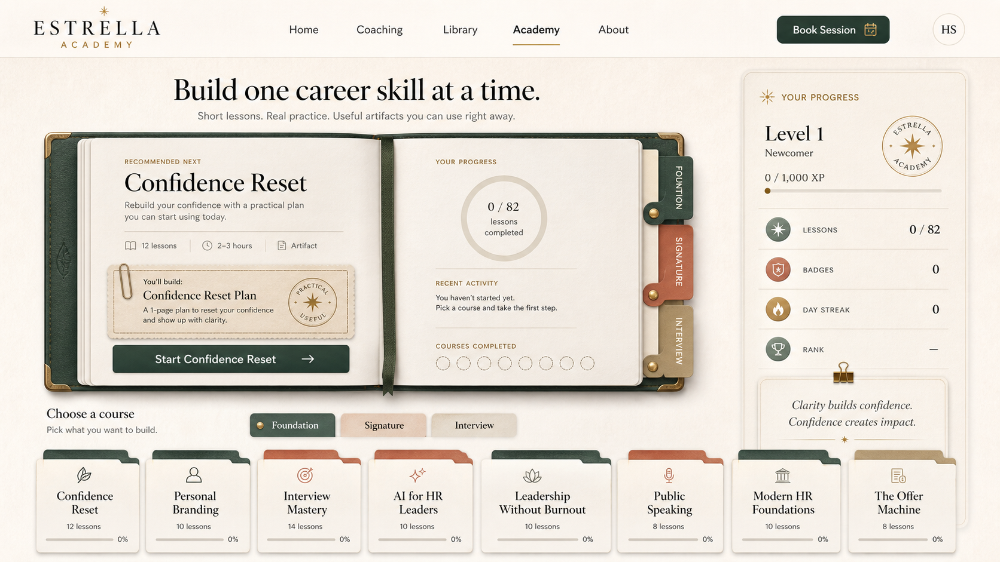
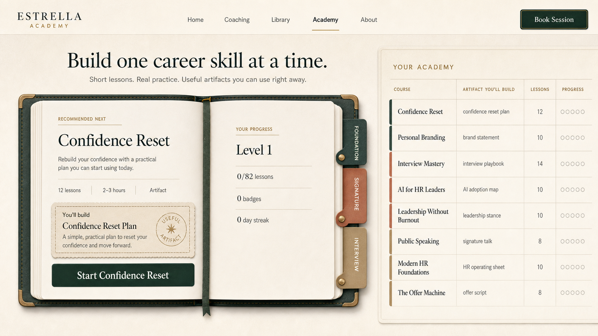
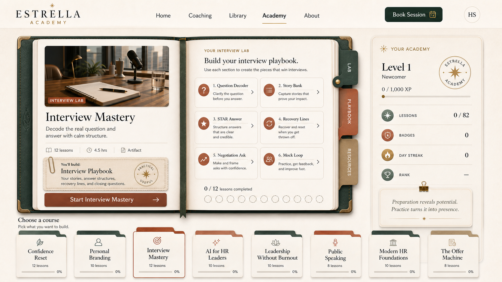
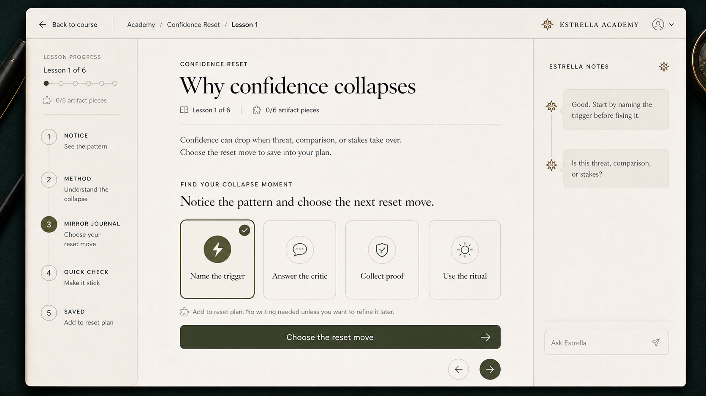

# Estrella Academy Dossier UI Handoff

## Purpose

Redesign the Academy module into one coherent premium learning system based on the approved open-book, folder, and artifact direction.

The Academy should feel like a professional course desk where learners build useful career artifacts, not a generic LMS.

## Source Mockups

### Approved Academy Home Direction

Use this as the primary visual anchor.



Why this is the anchor:

- The open Academy book is the main object.
- The recommended next course is clear.
- The right progress panel is useful without feeling like a dashboard.
- The course folders show all courses without making the page feel like a grid.
- The artifact slip explains why the learner is taking the course.

### Secondary Home Reference

This version is useful for the table density, but it should not replace the approved home direction.



Use only these ideas from it:

- Compact course inventory.
- Clear artifact names per course.
- Progress shown as small repeated marks.

Do not copy its administrative table as the main Academy home.

### Course Dossier Proof

This shows how a course page should inherit the Academy book system while changing the course instrument.



### Lesson Studio Proof

This shows how the lesson player should become a focused dossier page, with Estrella as a quiet margin note and the course-specific action in the center.



## Core Decision

Use a **Full Dossier System Refactor**.

Do not only redesign the lesson player. Do not pilot only 2-3 courses. The Academy already runs through shared renderers, so the safer product decision is to redesign the shared Academy layer once and let all 8 courses pass through the same system.

## Product Rule

One Academy world. Eight course instruments.

Do not create eight unrelated UIs. Use one shared dossier system, then vary the course instrument, artifact, course cover image, accent tab, choices, and action copy per course.

## Visual System

### Preserve

- Cream paper background.
- Open deep-green leather Academy book.
- Folder/course cards.
- Artifact slips and stamps.
- Generated course cover images.
- Right-side progress panel.
- Professional seals and certificates.
- Editorial serif headings with clean sans UI labels.
- Muted gold, deep green, ivory, rust, and tan accents.

### Avoid

- Generic dashboards.
- LMS grids.
- Purple or blue gradients.
- Glassmorphism.
- Chat-dominant layouts.
- Overloaded nested cards.
- Jargon labels.
- Childish game badges.

## Page Map

### 1. Academy Home

Purpose: help the learner choose the next course and understand progress.

Required UI:

- Main open-book spread.
- Recommended next course.
- Artifact slip: `You'll build: [artifact]`.
- Start or resume CTA.
- Progress page inside the book.
- Course folders below.
- Right-side progress panel.
- Track tabs: `Foundation`, `Signature`, `Interview`.

Primary CTA examples:

- `Start Confidence Reset`
- `Continue Interview Mastery`
- `Open your artifact vault`

### 2. Track / Section View

Purpose: filter the Academy by course family without becoming a separate dashboard.

Tracks:

- `Foundation`
- `Signature`
- `Interview`

Use folder tabs, not dashboard filters. Each track should explain what kind of artifacts it helps build.

### 3. Course Dossier Page

Purpose: show what this course builds and where the learner is.

Required UI:

- Course cover image from `Assets/Course_Covers`.
- Course title and short promise.
- Course instrument label.
- Artifact slip: `You'll build: [artifact]`.
- Artifact sections/modules.
- Lesson path.
- Start/resume CTA.
- Course-specific accent tab/color.

Use the `Interview Mastery` proof mockup as the course-page pattern.

### 4. Lesson Studio

Purpose: let the learner complete one lesson and add one piece to the artifact.

Required UI:

- Back to course.
- Lesson progress spine.
- Current lesson title.
- Short readable lesson content.
- Course-specific practice surface.
- Estrella notes as a side margin, not a large chat app.
- Quick check.
- Saved/artifact confirmation.

Lesson stages:

- `Notice`
- `Method`
- `[Course instrument]`
- `Quick check`
- `Saved`

### 5. Artifact Vault

Purpose: show completed and in-progress artifacts.

The vault should feel like an archive drawer or folder shelf.

Each artifact shows:

- Course.
- Artifact name.
- Completed pieces.
- Saved choices/drafts.
- Export/open action when ready.

### 6. Completion / Certificate

Use professional seals, stamps, certificates, and archive states.

Do not use childish trophies or noisy celebration UI.

## Course Instruments

| Course | Instrument | Artifact | Default interaction |
|---|---|---|---|
| AI for HR Leaders | Decision Map | AI adoption map | Choose: Automate, Augment, Keep human, Not ready |
| Personal Branding | Reputation Studio | Brand statement and visibility plan | Choose clarity, proof, specificity moves |
| Interview Mastery | Interview Lab | Interview playbook | Choose: Clarify, Headline, Proof story, Recover |
| Modern HR Foundations | Operating Map | HR operating sheet | Choose people, process, business, risk moves |
| Public Speaking & Executive Presence | Rehearsal Room | Signature talk kit | Rehearse opening, cut, pause, handle question |
| Confidence Reset | Mirror Journal | Confidence reset plan | Choose reset move |
| Leadership Without Burnout | Energy Board | Leadership rhythm plan | Choose Keep, Delegate, Decline, Recover |
| The Offer Machine | Offer Desk | Offer close kit | Set floor, target, ask, pause |

## Interaction Rules

### Writing Rule

Default: no writing.

Only show a text input when:

```js
exercise.interaction.requiresWriting === true
```

Current data:

- 82 total lessons.
- 69 choice/rehearsal/review lessons.
- 13 writing lessons.

For non-writing lessons:

- Show choice tokens, sorting, selection, rehearsal, check, or save action.
- Save selected move into artifact progress.
- Do not ask the learner to write an answer.

For writing lessons:

- Keep the input focused.
- Label it as artifact work.
- Use `Save the useful words`, not `Submit`.

### Estrella Tutor Rule

Estrella is a quiet coaching margin.

She can:

- Ask a clarifying question.
- Pressure-test a selected move.
- Point to the next useful action.

She must not:

- Pretend to grade.
- Fake live AI evaluation.
- Take over the page as the dominant chat interface.

## UX Copy Rules

Use action and outcome labels.

Good:

- `Choose the reset move`
- `Add to playbook`
- `Check this AI decision`
- `Rehearse this answer`
- `Save the useful words`
- `Open your artifact vault`

Avoid:

- `Submit`
- `Practice move`
- `Module mechanic`
- `Bloom`
- `Archetype`
- `XP`
- `Gamification`
- Fake praise.
- Fake grading.

Empty states should point to the artifact.

Good:

- `This fills as you finish lessons.`
- `Finish one lesson to add the first piece.`
- `No saved moves yet.`

Avoid:

- `0 items`
- `No data`
- `Nothing here`

## Implementation Surfaces

Main file:

- `estrella/index.html`

Main content file:

- `estrella/academy-content.js`

Generated course images:

- `estrella/Assets/Course_Covers/*.png`

Existing render functions to refactor:

- `renderSky`
- `skyContinueHTML`
- `skyTracksHTML`
- `skyBrowseHTML`
- `skyYouHTML`
- `openCourse`
- `artifactSlotsHTML`
- `atelierPathHTML`
- `openLesson`
- `buildBeats`
- `lessonWorkCopy`
- `openVault`
- `openConstellation`

State to preserve:

- `AST.lessons`
- `AST.courses`
- `AST.tracks`
- `AST.badges`
- `AST.lastLesson`
- localStorage key: `estrella.academy.v1`

Do not break:

- Quiz pass/completion.
- Course completion.
- Badge/certificate logic.
- Saved drafts/choices.
- Vault.
- Mobile lesson/tutor toggle.

## Build Strategy

Implement as one shared Academy refactor, not course-by-course one-offs.

Recommended order:

1. Add shared dossier/book/folder CSS components.
2. Redesign Academy home to the approved mockup direction.
3. Redesign course dossier page using shared course mechanics.
4. Redesign lesson studio using `exercise.interaction`.
5. Redesign vault and certificate states.
6. Browser QA all states listed below.

## Responsive Behavior

### Desktop

- Fixed-height Academy workspace.
- Main book/dossier visible.
- Right progress or Estrella panel visible.
- Only internal panes scroll.
- Avoid full-page scroll where possible.

### Mobile

Stack into focused sections:

1. Course/lesson header.
2. Current artifact/action.
3. Lesson content.
4. Progress drawer.
5. Estrella drawer/toggle.

Requirements:

- 44px minimum tap targets.
- No horizontal scroll.
- Keyboard order matches visual order.
- Reduced motion respected.

## QA Matrix

Test these states before calling the Academy refactor done:

- Fresh learner.
- In-progress learner.
- Completed lesson.
- Completed course.
- Choice lesson.
- Writing lesson.
- All 8 course dossier pages.
- Artifact vault.
- Certificate/completion modal.
- Mobile Academy home.
- Mobile course page.
- Mobile lesson studio.
- Estrella toggle.
- Reduced motion.
- Keyboard focus states.

## Definition of Done

The refactor is done when:

- Academy home matches the approved open-book/folder/artifact direction.
- Every course page uses the same dossier system with its own instrument and artifact.
- Lesson studio changes its practice surface based on `exercise.interaction`.
- Non-writing lessons do not show textareas.
- Writing lessons only appear where artifact words are required.
- Saved choices/drafts appear in artifact progress and vault.
- The constellation is secondary progress, not the main UI.
- Desktop and mobile are both usable and visually coherent.
- The learner-facing copy contains no internal design or pedagogy jargon.
